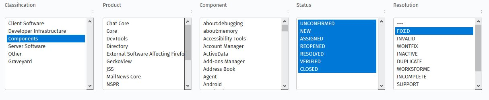
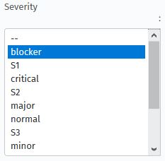
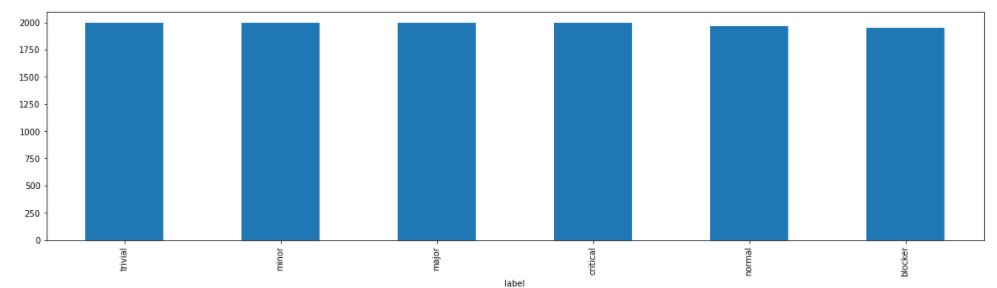
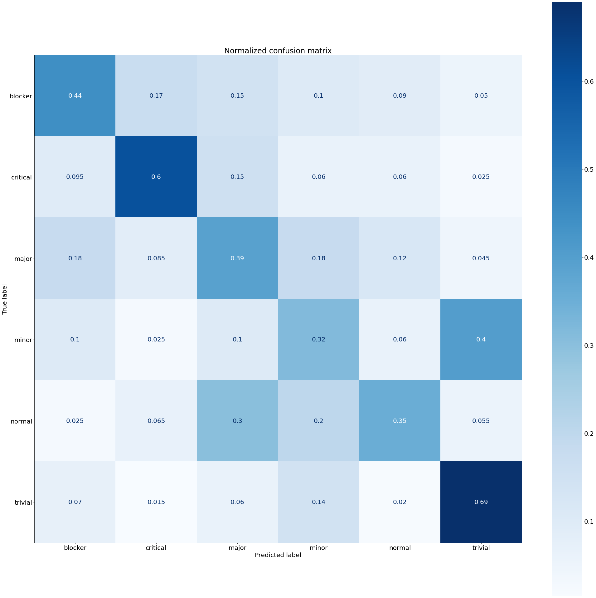
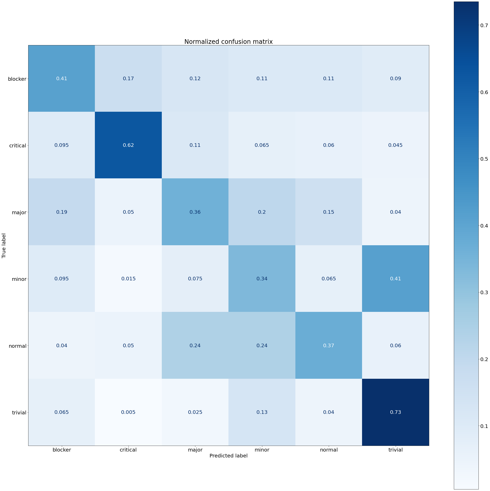

# Project for Seminar: Data Science in for Software Engineering

## Purpose
With this work we intend to do a reproduction of the paper “Predicting the Severity of a Reported Bug” by Lamkanfi et al. (Find the paper [here](https://doi.org/10.1109/MSR.2010.5463284)).
The mission of this paper was finding out if it is possible to “accurately predict the severity of a reported bug using text mining algorithms”. We took the findings they made here and tried to reproduce this work, with some small differences:

-	They took their data samples from Mozilla, Eclipse, and GNOME, whereas we took our data samples only from Mozilla.
-	They only made the difference between the severity types “non-severe” and “severe”, whereas we differentiated 6 different types of severites (“blocker”, “critical”, “major”, “normal”, “minor”, and “trivial”).
-	Due to their findings, we decided to do only their “best solution”, i.e. we only conducted an experiment where we took the one-line summary of each bug, we only took sets of 2000 samples instead of 500, 1000, and 2000, and we only conducted a cross-component approach instead of the additional per-component approach.

## Data Fitting
### Retrieving Data
The data was gathered from [Bugzilla](https://bugzilla.mozilla.org/query.cgi?format=advanced) with the following settings:

All the eight categories of severities were set here:

There are eight Types of severites:

1. blocker
2. critical
3. major
4. normal
5. minor
6. trivial
7. enhancement
8. N/A

The following columns were chosen:

The amount of data items found per type* was according to the following table:

| Type | Training | Testing | Found Bugs Total |
| --- | --- | --- | --- |
| blocker | 2000 | 200 | 2332 |
| critical | 2000 | 200 | 10000 |
| major | 2000 | 200 | 10000 |
| normal | 2000 | 200 | 10000 |
| minor | 2000 | 200 | 10000 |
| trivial | 2000 | 200 | 6730 |
| enhancement | - | - | 45 |
| N/A | - | - | 1509 |
| Total | 12000 | 1200 | 49062 |

(* All lists were retrieved on 2020-12-03. List "blocker" was renewed on 2021-01-27)

### Preparing the Data
The data was prepared as follows:
- The severity types "enhacement" and "N/A" were both ignored due to insufficient data.
- Deleting of rows where the bug description was saved in more than one cell (not suitable for input).
- Bug Ids were deleted (because they are useless)

### Lists 

| Name | Purpose |
| --- | --- |
| training_list_v2.csv | List with data for the training phase of the ML Algorithm. Each severity Type is represented by exactly 2000 examples. |
| testing_list_v2.csv | List with data for the testing phase of the ML Algorithm. Each severity Type is represented by exactly 200 examples. |
| bug_list.csv | List with data for the initial test to see if the project is feasible. |

## Execution
### Further Pre-Processing
-	The Data was imported into a Jupyter Notebook
-	We dropped rows with missing values or label to avoid false entries. This resulted in a training set with a total of 11962 samples and a testing set with a total of 1999 samples. 
-	We removed special characters

### Pre-Processing of Bug Summary
-	Pipeline which transformed the words into ngrams ranging from (1,1) to (1,3)
-	Further features were transformed into the tfidf measure reflecting the importance of a word
-	The label encoding was done with the method LabelEncoder()

### Training the Classifiers
Two different classifiers were used without any parameter optimization:
-	Naïve Bayes
-	SGD

To measure the accuracy of each model, we used the following scores
-	Precision
-	Recall
-	f1

To calculate the measurements we used cross validation.  The parameter optimization for both classifiers was achieved with Grid Search:

Optimizations for Naïve Bayes:
-	ngramm

Optimization for SGD
-	Loss function
-	Regularization
-	Early Stopping

### Applying the Classifiers to the Test Set
To calculate the accuracy of each classifier the best model was run with the test set and the results visualized with a normalized confusion matrix. 

## Results
The following scores were reached:

| Classifier | Precsision | Recall | f1 |
| ----- | ----- | ----- | ----- |
| Naïve Bayes | 0.402 | 0.402 | 0.402 |
| SGD | 0.405 | 0.405 | 0.405 |

The following accuracy scores were reached:

| Classifier | Accuracy Score |
| ----- | ----- |
| Naïve Bayes | 0.466 |
| SGD | 0.455 |

The following relative confusion matrices were received:

<figure class="image">
  
  <figcaption>Naïve Bayes</figcaption>
</figure>

<figure class="image">
  
  <figcaption>SGD</figcaption>
</figure>

