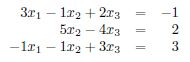
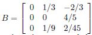
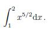
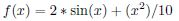
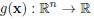

# Exam 2018

## Exercise 1
Consider the polynomial interpolation of the following function:

at the nodes {x_i} = [-1.0,-0.75,-0.5,-0.25, 0]. Knowing the values {y_i} corresponding to the evaluation of
the function f at the given nodes {x_i}, you want to approximate its value at x_bar = -0.4. (The exact value is
f(x_bar) = 0.0183156.)

### Exercise 1a: Theory
Answer the following questions about polynomial interpolation.

#### Exercise 1a.1
Consider the given data, what can you say about the existence and uniqueness of the interpolating
polynomial of f in relation to its degree?

#### Exercise 1a.2
Write the general Lagrange form of an interpolating polynomial of degree 2.

### Exercise 1b: Computation
Compute the interpolating polynomials of degrees 2 and 3 of the function f. Choose the data for your estimates
to attain the best possible accuracy among the given ones. You can express the polynomials in the form you prefer.
For each resulting polynomial Pi_2_f(x) and Pi_3_f(x):
- write the expression with all coefficients (two decimal digits are sufficient);
- report the error of the approximation at x_bar.

### Exercise 1c: Theory
Suppose now to know the function in more points. Using the following nodes

[-1.75, -1.5, -1.25, -1, -0.75, -0.5, -0.25, 0, 0.25, 0.5, 0.75, 1.0, 1.25]

the interpolating polynomial of degree 12 gives an error higher than the one of degree 2. Can you explain why?
How could you reduce the errors related to this phenomenon?

## Exercise 2
Consider the following linear system:

### Exercise 2a: Theory

#### Exercise 2a.1
Under which conditions does the LU factorization of a matrix A (element of) R^(nxn) exist and is it unique?

#### Exercise 2a.2
The LU factorization of a square matrix A can be obtained through the Gauss algorithm. How much does this algorithm cost, in terms of number of operations, for a matrix of size n x n? (It is
not required to show all computations).

#### Exercise 2a.3
Define the spectral condition number of a square matrix A. Assuming that A (element of) R^(nxn) is symmetric and
positive definite, which information about the error in the solution of the perturbed system `Ax = b + delta*b`
does the condition number provide?

### Exercise 2b: Computation
Solve the given linear system using the LU factorization without pivoting. Explain how you obtain the result.

### Exercise 2c: Theory
Consider the Guass-Seidel method to solve the general linear system Ax = b.

#### Eercise 2c.1
Write the potential advantages of using iterative methods rather than direct methods for the solution
of linear systems.

#### Exercise 2c.2
Write down the iterative equations (in matrix form) for a general iteration k of the Gauss-Seidel method.

### Exercise 2d: Theory
The iteration matrix of the Guass-Seidel method applied to the given system is

According to this matrix, study if the method converges. If yes, estimate how many iterations are needed to reduce
the initial error by a factor of 10. (If you need, you can use MATLAB to perform computations.)

### Exercise 2e: Computation
Use the Gauss-Seidel method to solve the given system, starting with initial guess x0 = [-1, 1, 1]^T. Stop the
iterations when the increment between two consecutive iterations is less than epsilon = 0.01 (in Euclidean norm).
Report the result along with the number of iterations performed and the final residual in l1-norm.
*Hint*: once you have properly defined the matrix P and the vector r, in MATLAB you can compute directly `z = P\r`.

## Exercise 3
Consider the following integral:

### Exercise 3a: Theory
Answer the following questions.

#### Exercise 3a.1
Write the simple Simpson formula and explain how it is related to the general Newton-Cotes formula.

#### Exercise 3a.2
What is the degree of exactness of a quadrature formula? Which is the degree of exactness for the
Simpson quadrature rule?

### Exercise 3b: Computation

#### Exercise 3b.1
Integrate the given function using the composite Simpson rule, using the following
integration step-lengths H = 0.5, 0.25. Report the results with 6 decimal digits.

#### Exercise 3b.2
The exact value of the given integral is `I_ex = (16*sqrt(2)-2)/7 = 2.9467739`. For the two approximations
obtained in the previous point, compute the errors and estimate (graphically or analytically) the order of
convergence of the composite Simpson quadrature rule. Compared the result to the theoretical one.

## Exercise 4
Consider the following non-linear function:

which has a local minimizer in the interval I0 = [-4,0].

### Exercise 4a: Theory
Answer the following questions.

#### Exercise 4a.1
For a general function

with n > 1, which are the sufficient and the necessary conditions
to have a local minimum?

#### Exercise 4a.2
Concerning the given function (n = 1), there exist different possibilities to compute the local minimizer
`x*` with an iterative methods. Identify a suitable one and explain the expected convergence properties.

### Exercise 4b: Computation
Compute the local minimizer `x*` (element of) I0 of the given function with the method you have chosen in Exercise 4a.2. Report
the result along with the minimum value of f. Explicitly check if the conditions for a local minimum are satisfied.
*Hint:* You can choose as initial values the interval I0 or its midpoint. In the stopping criterion, you can use a
tolerance of 0.001.
