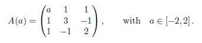

# Exam 2019

## Exercise 1
We want to use the inverse power method to compute the smallest eigenvalue (in absolute value) of the parametric
matrix: 

### Exercise 1a: Theory

#### Exercise 1a.1
With respect to the power method, what are the main differences and the extra operations that the inverse
power method requires?

#### Exercise 1a.2
Which hypotheses are required for the inverse power method to converge?

### Exercise 1b: Computation

#### Exercise 1b.1
Implement the inverse power method in a function `inversePower.m` with the input-output specifications
given below. You can use the MATLAB function to compute the inverse of the matrix A only once, but
you cannot use the command `\`.

| Input| |
| ------------- | ------------- |
| A | Matrix of which we want to compute the smallest eigenvalue |
| x0 | Initial guess of the eigenvector |
| itMax | Maximum number of iterations |
| tol | Tolerance epsilon of hte method when `|lambda_k^-1 - lambda_(k-1)^-1| < epsilon` |

| Output| |
| ------------- | ------------- |
| lambda | Lambda of the smallest eigenvalue |
| iter | Performed iterations |
| err | The last performed error `|lambda_k^-1 - lambda_(k-1)^-1|` |

#### Exercise 1b.2
Implement the script `findEigs.m` that applies the inverse power method to the matrix A(a) for a in
`linspace(-2,2,500)`, stores the eigenvalues and the number of iterations for all the as and plot them in
two different plots:
- `eigenvalues.fig` where the minimum eigenvalues are shown with respect to a;
- `iterations.fig` where the iterations are shown with respect to a.
Use the initial guess x0 = [1,1,1]^T , maximum 500 iterations, and epsilon = 10^-8 for each a.
Hint: do not worry if for some values of as, the algorithm gives weird results (see exercise c.1).

### Exercise 1c: Theory

#### Exercise 1c.1
Try to explain why, when a ~= -1:35, the algorithm does not provide the expected results.

*Hint*: choose a value of a for which the method has not converged (check the error), and print on screen
the eigenvalues of the matrix A(a) related to that parameter using the MATLAB function.

## Exercise 2
Consider the linear system of equations Ax = b where the matrix A (element of) R^(3x3) is defined as `A = I - C`, with I the identity matrix and C (element of) R^(3x3) has the following entries c(i,j) = i + j, for i,j = 1, ...,3. The vector b is defined as b = [-44,-57,80]^T. The matrix A of the given problem is symmetric, but not positive definite. However, the solution x satisfies also the problem:

in which the matrix `A^T*A` is symmetric positive definite.

### Exercise 2a: Theory 
Answer the following questions:

#### Exercise 2a.1
State at least two equivalent conditions under which the solution of a linear system exists and is unique.

#### Exercise 2a.2
An iterative method to solve the given linear system can be built on a general splitting `A = M-N`. A
first, but not good, idea could be the splitting M = I and N = C. Write the first normal form and the
consistency relation for this splitting, defining each matrix and vector involved.

#### Exercise 2a.3
Explain why the iterative method based on the splitting defined in exercise 2a.2 (`A = M-N`, with M = I and
N = C) cannot be used to compute the solution of the given linear system.

### Exercise 2b: Computation

#### Exercise 2b.1
According to the feature of the matrix `A^T*A`, identify one iterative method that can be used to compute
the solution of the system above. Explain your answer.

#### Exercise 2b.2
Implement the iterative method you have identified at exercise 2b.1 in a MATLAB function called `itermeth.m` that
complies with the input-output table given below. The function should print on screen the spectral radius
of the iteration matrix, use maximum 500 iterations, and use a stopping criteria based on the increment
between two consecutive iterations. You can use the MATLAB function to compute the inverse only
once, but you cannot use the command `\`.

| Input| |
| ------------- | ------------- |
| A | Square Matrix of a general linear system Ax=b |
| b | Known vector b |
| x0 | Initial guess |
| tol | Tolerance for the stopping criterion |

| Output| |
| ------------- | ------------- |
| x | Solution |
| it | Number of performed iterations |

#### Exercise 2b.3
Create a script named `solvelinsys.m` which uses the function itermeth implemented in exercise 2b.2 to solve the
system above. Use as initial guess a vector of zeros, and a stopping tolerance tol = 10^-8.

### Exercise 2c: Theory
Linear system can be solved also by direct methods.

#### Exercise 2c.1
Which is the possible drawback of solving the system above rather than Ax = b?

#### Exercise 2c.2
We can solve system above by using the Cholesky factorization. How many arithmetic operations are roughly
needed to compute x if the Cholesky factorization is used to decompose the matrix `A^T*A`?

## Exercise 3
We want to numerically integrate the function

over the interval 4 <= x <= 9, that is to compute

(exact result : I_ex = 200) :

We want to use a composite quadrature rule over M sub-intervals I_k = [x(k-1), x(k)] (for k = 1, ..., M), using 3
nodes in each sub-interval (as shown in Figure 1 for M = 4):

For each interval I_k, the three nodes {y_j} are defined on the
canonical interval [-1,1] as

The weights {alpha_j(k)} and nodes {y_j(k)} are, respectively, {alpha_j_bar(k)} and {y_j_bar(k)} mapped to the sub-interval I_k.

### Exercise 3a: Theory
Consider the simple version of the given quadrature rule Q(f), i.e. M = 1.

#### Exercise 3a.1
What is the maximum degree of exactness that we can guarantee to reach with these nodes choosing
appropriate

Justify your answer.

#### Exercise 3a.2
Briefly explain a way to find the weights {alpha_j_bar} to obtain the degree of exactness stated in exercise 3a.1.

### Exercise 3b: Computation
Use the weights

#### Exercise 3b.1
Write a function myQuadrature.m that implements the composite quadrature rule Q(f) given by equation
above, by using M + 1 equi-spaced points {x0, ..., xM} between a = x0 and b = xM.

| Input| |
| ------------- | ------------- |
| f | Function to be integrated |
| a | Left bound of the domain of integration |
| b | Right bound of the domain of integration |
| M | Number of subintervals |

| Output| |
| ------------- | ------------- |
| quad | Q(F) of the approximated integration |

#### Exercise 3b.2
Implement the script testQuadrature.m that uses the function `myQuadrature.m` to compute the integral
above using different number of sub-intervals: `M = [2^q : q = 1, ..., 10]`. For every M, compute and
store the error with respect to the exact integral and plot it in the appropriate scale with reference orders
1, 2, 3, 4 in dotted lines. Add a proper legend and save this figure as `quadConvergence.fig`.

#### Exercise 3b.3
What you can say about the order of convergence looking at the figure `quadConvergence.fig`? Is it better
or worse than the composite Simpson rule?

## Exercise 4
We want to use the Newton's method to find the zeros of the following system of non-linear equations

### Exercise 4a: Theory
Answer the following questions

#### Exercise 4a.1
Which are the main drawbacks and risks of the Newton's method for non-linear equations?

#### Exercise 4a.2
Suppose that the Newton's method is applied to a linear system Ax = b. How does the iterative formula
look and how many iterations does it take to converge?

### Exercise 4b: Computation

#### Exercise 4b.1
Implement the Newton's method for non-linear systems in a function called newtonMeth.m with the input-
output table given below. The function should solve the required linear system by using the LU decom-
position with pivoting by row (you can use the MATLAB command for the decomposition). Add to the
function a integer variable NPiv to count in how many iterations the LU decomposition has used pivoting.
Use a stopping criteria based on the l2-norm of the difference between two consecutive iterations.

| Input| |
| ------------- | ------------- |
| Ffun | Handle for function f(x) |
| Jfun | Handle for the Jacobian of f(X) |
| x0 | Initial guess |
| tol | Tolerance epsilon for the stopping criteria |
| itMax | Maximum number of iterations |

| Output| |
| ------------- | ------------- |
| x | Solution |
| it | Number of performed iterations |
| NPiv | Number of iterations in with pivoting is performed |

#### Exercise 4b.2
Write a MATLAB script nlsyst.m to solve the given system above with the Newton's method implemented
in exercise 4b.1. Use as initial guess x(0) = [0, 0.5]^T, as tolerance epsilon = 10^-8 and maximum 50 iterations.

#### Exercise 4b.3
Add to the MATLAB `script_nlsyst.m` the commands to print on screen the 1-norm of the residual at
the last iteration.
