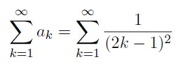
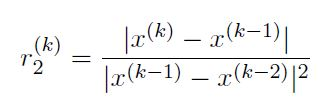
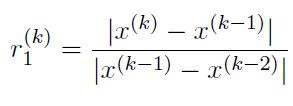

# Homework 1 2019

[Link to Homework 1 2019](https://github.com/dastal/Numerical_Methods_in_Informatics/tree/master/Additional/HW_1_2019)

## Exercise 1

Consider the following series:

### Exercise 1a
Write a script called `series.m` which:
- finds the first 10 values of the partial sums An for n=1,...,10
- plots these values as discrete points (no lines between them);
- adds your name as a title on the top of the plot;
- adds labels for the x and y axes;
- saves automatically the plot in `series_plot.fig`;
- closes the figure.

### Exercise 1b
The series Ak converges to `A = pi^2/8`. Build a function `tolerance_series.m` that takes as input a tolerance epsilon and stops the partial sums An when the error `abs(An-A)<=epsilon`. The output is the first n such that `abs(An-A)<=epsilon`.

| Input |  |
|---|---|
| eps | Tolerance |

| Output |  |
|---|---|
| n | first n such that `abs(An-A)<=epsilon` |

### Exercise 1c
Use the routine developed in point Exercise 1b with
epsilon = 0.0015. Generate a new plot of the values of An, for n from 1 up to the number of
iterations just computed (for epsilon = 0.0015), along with the actual limit of the series.

Hint: use only marks for the values of An and a line (dotted or dashed) with a different color
for the limit value.

## Exercise 2
We look now at the solution of non-linear equations through iterative methods.

### Exercise 2a
Define a function called `secantmethod.m` that implements the secant method to solve a non-linear equation according to the following input and output values.

| Input |  |
|---|---|
| fun | function handle |
| x0 | intial value x0 |
| x1 | intial value x1 |
| eps | prescribed convergence tolerance |

| Output |  |
|---|---|
| x | approximated result |
| it | number of performed iterations |

- The stopping criterion should be based on the absolute value of the difference between two subsequent iterates.
- Set a maximum number of iterations to avoid the possible infinite loops in your script.
-  Before return, if successful, the routines prints a message to inform the user it has reached the prescribed convergence criterion and the number of iterations performed. Otherwise, it prints an error message.

### Exercise 2b
Write a script fille named `roots_secant.m` which uses the function secantmethod of Exercise 2a to compute some zeros of the function `f1 = 2cos(3x)-exp(x)`. More precisely,
- test your function with initial guesses x0 = 0.1 and x1 = 0.11, and as convergence tolerance epsilon = 10^-8.
- test your function with initial guesses x0 = -1.0 and x1 = -0.9, and as convergence tolerance epsilon = 10^-5.
- generate a plot with the value of function f1 in the interval -5<=x<=5. Add to the plot a different mark for each of the two roots you have just found. Add a legend with three labels.

## Additional Exercise 3
Here, we look at the Newton's method.

### Exercise 3a
Write a routine which implements the Newton's method, saving in a vector all approximate (intermediate) results, i.e. all x(k). It can take the following input and output

| Input |  |
|---|---|
| fun | function handle |
| ffun | derivation function handle |
| x0 | intial value |
| eps | prescribed convergence tolerance |
| itMax | number of maximum iterations |

| Output |  |
|---|---|
| x | approximated result |
| it | number of performed iterations |
| xx | vector contains all computed x(k) |

### Exercise 3b
Test the routines on the following functions (convergence epsilon = 5.0 * 10^-5):
- f1 = x2 - 9, with initial guess x0 = 0.1
- f2 = (x - 4)^2, with initial guess x0 = 0.1
- f3 = tanh(x), with initial guess x0 = 2.0 (the derivative is f'3(x) = 1 - tanh(x)^2 )

### Exercise 3c
Check the convergence rate for f1, by plotting the quantity

From the theory, we can expect a quadratic convergence, so the quantity r2 should approach
a nonzero constant as k -> inf. Does it happen?

### Exercise 3d
Check the convergence rate for f2, by plotting the quantities r2 and also

which is representative of a linear convergence. What can you say about the convergence rate
of Newton's method in this case? Can you justify your findings?

### Exercise 3e
What can you say about the application of the Newton method to solve f3?
