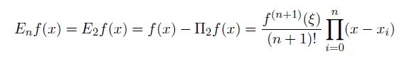

# Homework 2 2019

[Link to Homework 2 2019](https://github.com/dastal/Numerical_Methods_in_Informatics/tree/master/Additional/HW_2_2019)

## Exercise 1
Given the following function `f(x) = cos(x)` and the nodes `x0 = 0, x1 = 0.6, x2 = 0.9`, consider the interpolation polynomial of degree at most two.

### Exercise 1a
Write a function called `lagr_polynomial.m` that constructs L2f to approximate f in a given xBar according to the following input and output specifications:

| Input | |
| --- | --- |
| x | given point xBar |

| Output | |
| --- | --- |
| res | The approximated value L2f(xBar) |
| err | The actual error at the given point |

The script should
- print on screen the approximated value L2f(xBar) with four decimal points
- create a plot with the Lagrange characteristic polynomials `phi_k(x), k = 0, 1, 2` in the interval x element of [0, 1] and save it as `lagrangianpoly.fig`
- highlight in the previous plot, the points corresponding to `phi_k(x_k), k = 0, 1, 2` (where xk are the given nodes), by using squared marks
- print on screen the actual error of L2f at the given point

### Exercise 1b
The formula recalled below expresses the error of the polynomial interpolation:




Compute the error bound in the interval x element of [0, 1], for the given nodes x0, x1, and x2 (but a generic x element of [0, 1]).
For this point, you can exploit MATLAB capabilities or compute it analytically. In the former
case, write a script called `lagr_error.m` which includes all passages with relevant comments
and prints at the end the error bound. In the latter case, write all passages in a text file
called `lagr_error.txt` or submit a scanned file labeled `lagr_error.pdf`.

## Exercise 2
Consider the function `f(x) = exp(-x^2)` over the interval x element of [-d, d] element of IR, with d > 0

### Exercise 2a
Set d = 5, write a script named `polyinterp.m` which, given the nodes

```
xk = -d + (2*d)/b * k
0<=k<=n
```

- computes the interpolation polynomials Lnf for degrees n = 2, 4, 6, 8, 10
- evaluates the polynomials Lnf in the points `xBarj = -d + (2 * d) / 1000 * j` for 0<=j<=1000 and plots all approximations, together with the function f(x), in one plot
- saves the previous plot in a file `interp_n.fig`

### Exercise 2b
Set d = 5, write a script named `piecewiseinterp.m` which exploits the MATLAB routines for the piecewise polynomial interpolation. More specifically,

- define the nodes xk by using 8 subintervals of equal length H
- compute the linear interpolation LH1f and the cubic spline interpolation LH3f (with a not-a-knot condition)
- evaluates the polynomials LH1f and LH3f in the points `xBarj = -d + (2 * d) / 1000 * j` for 0<=j<=1000 and plots both approximations, together with the function f(x), in one plot
- saves the previous plot in a file `piecewise.fig`

### Additional Exercise 2c
Repeat the Ecercise 2a with d = 1. Then,
- compute the error `Edn = max(0<=j<=1000) |(f - Lnf(xBarj)|` and use these values to derive (approximately) the rate of convergence with respect to the number of nodes n
- find an approximate value of dmax, such that the error Edn decreases for increasing n
- plot the logarithm of the error for d = dmax=2 with respect to n and determine the constant p in the estimate `Edn <= C*e^(-p*n)`

## Additional Exercise 3
The weekly and the daily values of the stock prices of the company Facebook Inc.1 from Oct. 1, 2017
to Sep. 30, 2018 are reported in the attached files `StockPrices.csv` and `StockPrices_day.csv`,
respectively. In particularly, the former contains 52 entries, one for each week of the year; the latter
includes less than 365 entries, since stock prices are available only on working days.
First of all, load both data-sets in MATLAB, without modifying the input files. For instance, you
can load the weekly data-set by means of `csvread('StockPrices.csv',2,0)`, which skips the first
two lines of the input file (see the help).

### Exercise 3a
For the weekly data-set, compute the least-squares approximations of degree m = 1, m = 2,
and m = 4. Then, for each approximation, answer the following questions:

- Which are the coeficients a0, a1, ... , am of the approximating `fTilde(x) = a0 + a1x + ... + amxm`?
- Which is the maximum squared residual `( fTilde(xi) - yi)^2`?
- Which is the sum of square of the residual? Why is this number important for this method?

### Exercise 3b
Compute also the cubic spline interpolation of the weekly data-set. Produce a figure, that
includes the original points, the cubic spline, and the three least-square approximations.

### Exercise 3c
Compute the least-square approximations of degree m = 1, m = 2, and m = 4, and the
cubic spline also for the daily data-set. Produce a figure as in point (b) including all four
approximations.

### Exercise 3d
Look at the figures obtained in points (b) and (c). If you want to forecast the stock price
15 days (or 2 weeks) after the last day in the data-sets, which approximation would you use,
and why? What have you obtained? The actual value on Oct. 15, 2018 was 153.32, how can
you explain the differences from the data predicted and the actual value?


