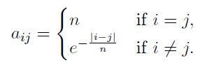
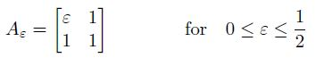
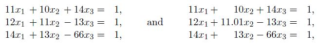

# Homework 3 2019

[Link to Homework 3 2019](https://github.com/dastal/Numerical_Methods_in_Informatics/tree/master/Additional/HW_3_2019)

## Exercise 1
Test numerically the computational complexity of the QR decomposition and of its application to the solution of the system of linear equations (in terms of number of  floating point operations). For this exercise, you are NOT allowed to use the `qr` MATLAB function.

### Exercise 1a
Write a function called `qrsolve.m` that implements the QR decomposition of a given matrix A according to the following input and output specifications.

| Input |  |
| ------- | ------- |
| A | Square matrix |

| Output |  |
| ------- | ------- |
| Q | orthogonal matrix of the QR decomposition |
| R | upper triangular matrix of the QR decomposition |

### Exercise 1b
Write a script called `qrcost.m` which uses the QR decomposition implemented before to solve the linear system Ab = x, where the elements of the matrix A element of R(n x n) are defined as:

and the right hand side vector is `b = [1, 0, 1, 0, ... , 1, 0]^T` element of R^n.

The script should, for n = 250, 500, 1000, 2000, 4000
- assemble the matrix A and the vector b as defined above,
- compute the QR decomposition of A by using your qrsolve.m and save the required time,
- use QR decomposition to solve the given system and store the required time,
- plot (in an appropriate scale) the CPU time required by the QR decomposition and the total time (decomposition plus solution) for the different values n by using only marks,
- add to the plot the theoretical complexities of the two tasks as dotted lines,
- complete the plot with appropriate legend and axes labels.
- save the plot as `qr_cost.fig`.

## Exercise 2
This exercise requires to implement the LU factorization without pivoting, in order to compare
the condition number of the resulting matrices with the one of the matrices given by the QR
decomposition.

### Exercise 2a
Implement the Gauss LU factorization without pivoting according to the following call `[L,U] = lu_nopivoting(A)`.

### Exercise 2b
Compare the condition number of the matrix

in QR and LU decomposition. Write a script called `compare_cond.m` which

- builds a vector that spans evenly the value of epsilon from 0.5 to 0.5/100 in 100 points
- for each epsilon, computes the QR decomposition `A_epsilon = Q_epsilon*R_epsilon` and the LU decomposition without pivoting `A_epsilon = L_epsilon*U_epsilon` (using the function implemented at Exercise 2a)
- for each ", computes and saves the condition number in the infinity norm of the matrices A_epsilon, Q_epsilon, R_epsilon, L_epsilon, and U_epsilon
- plots the condition numbers of the five matrices for the varying epsilon in a single plot, with appropriate legend and axes, and saves it as `ex_condition.fig`.

### Additional Exercise 2c
Solve the two linear systems

with the function lu nopivoting, without using the MATLAB command inv. Also test what happens if the right hand side of the first equation is replaced by 1.001. Try to explain the results.

## Additional Exercise 3
An electronics company produces transistors, resistors, and computer chips. Each transistor requires 6 units of copper, 6 units of zinc, and 2 units of glass. Each resistor requires 2, 3, and 1 units of the three materials, respectively, and each computer chip requires 4, 5, and 4 units of these materials, respectively.

### Exercise 3a
The available amount of material vary from week to week, so they need to schedule different
production each week. Indicate the weekly available amount of copper, zinc, and of glass as
bc, bz,and bg, respectively. Then, answer the following request:

- Write the matrix form of linear system of equations that can be solved to compute how many items of each product can be produced with the available material.
- Under which conditions the linear system is solvable?
- Which is a suitable solution strategy to take into account that the available material changes every week?

### Exercise 3b
Calculate by hand the LU decomposition of the matrix of the system defined in Exercise 3a.. Show the process step by step.

### Exercise 3c
Use the LU decomposition to compute the determinant of the matrix of the system.

### Exercise 3d
How many items of each product can be made if the following amount of material is available:

- c1. 210 units of copper, 95 units of zinc, and 235 units of glass.
- c2. 220 units of copper, 105 units of zinc, and 190 units of glass.
