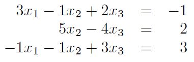
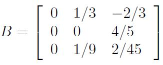
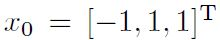

# Self Assesment Test

Consider the following linear system

## Exercise a: Theory

### Exercise a.1
Under which conditions does the LU factorization of a matrix A (element of) R^nxn exist and is it unique?

### Exercise a.2
Show that the conditions of exercise a.1 are satisfied by the given linear system.

### Exercise a.3
Give a definition of the condition number of a square matrix A and compute it accordingly for the given
system.

### Exercise a.4
What information about the accuracy of the solution of a linear system by means of direct methods
does the condition number provide?

## Exercise b: Computation
Solve the given linear system using the LU factorization without pivoting. Explain how you obtain the result.

## Exercise c: Theory
Consider the Guass-Seidel method to solve the general linear system Ax = b.

### Exercise c.1
Write at least two potential advantages of using iterative methods rather than direct methods for the
solution of linear systems.

### Exercise c.2
Write down the iterative equations (in matrix form) for a general iteration k of the Gauss-Seidel method,
defining all variables involved.

## Exercise d: Theory
The iteration matrix of the Guass-Seidel method applied to the given system is

### Exercise d.1
Show that, according to this matrix, the method converges.

### Exercise d.2
Estimate how many iterations are needed to reduce the initial error by a factor of 10.

## Exercise e: Computation
Use the Gauss-Seidel method to solve the given system, starting with initial guess 

Stop the iterations when the increment between two consecutive iterations is less than epsilon = 0.01 (in Euclidean norm).
Report the result along with the number of iterations performed and the final residual in l_inf-norm.

*Hint*: once you have properly defined the matrix P and the vector r, in MATLAB you can compute directly `z = P\r`.
