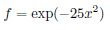
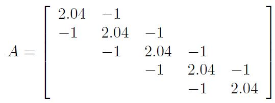
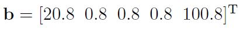
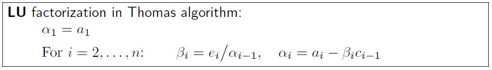
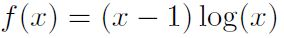
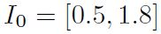

# Simulation Exam

## Exercise 1:
Consider the polynomial interpolation of the following function:

at the nodes {x_i} = [-1.0,-0.75,-0.5,-0.25, 0]. Knowing the values {y_i} corresponding to the evaluation of
the function f at the given nodes {x_i}, you want to approximate its value at x_bar = -0.4. (The exact value is
f(x_bar) = 0.0183156.)

### Exercise 1a: Questions
Answer the following questions about polynomial interpolation.

#### Exercise 1a.1
Consider the given data, what can you say about the existence and uniqueness of the interpolating
polynomial of f in relation to its degree?

#### Exercise 1a.2
Write the general Lagrange form of an interpolating polynomial of degree 2.

### Exercise 1b: Computation
Create a MATLAB script named `ex1_poly.m`
Compute the interpolating polynomials of degrees 2 and 3 of the function f. Choose the data for your estimates
to attain the best possible accuracy among the given ones. You can express the polynomials in the form you prefer.
For each resulting polynomial Pi_2_f(x) and Pi_3_f(x):
- write the expression with all coefficients (two decimal digits are sufficient);
- report the error of the approximation at x_bar.

### Exercise 1c: Question
Suppose now to know the function in more points. Using the following nodes

[-1.75, -1.5, -1.25, -1, -0.75, -0.5, -0.25, 0, 0.25, 0.5, 0.75, 1.0, 1.25]

the interpolating polynomial of degree 12 gives an error higher than the one of degree 2. Can you explain why?
How could you reduce the errors related to this phenomenon?

## Exercise 2
For the computation of exercises 2b abd 2c, create a MATLAB script named `ex2_thomas.m`
Given the system `Ax = b` with A (element of) R^nxn tridiagonal and b (element of) R^n.

### Exercise 2a: Questions

#### Exercise 2a.1
Determine the number of arithmetic operations required to compute the solution x (element of) R^n using
the LU decomposition given by the Thomas algorithm for tridiagonal matrices, as written below.
Explain how you reach the result and identify the number of operations per each phase of the solution
strategy. 
*Hint*: write the *complete* algorithm.

#### Exercise 2a.2
For the general case in which A is not tridiagonal, compute the complexity of the solution strategy
based on Gauss elimination method without partial pivoting.
Also in this case, identify the amount of operations per each phase of the solution strategy (per each
phase, you can consider only the major order, i.e., the highest power of n with its coefficient).

### Exercise 2b: Plot
Develop a plot of the number of operations versus n for n going from 2 to 30, with both solution strategies.

### Exercise 2c: Computation
For this task, you are not allowed to use the MATLAB commands inv nor lu.
Apply the Thomas algorithm to compute the solution of the system Ax = b with

and

## Exercise 3
Consider the following non-linear function

which has a zero with multiplicity `m = 2` in the interval

### Exercise 3a: Questions

#### Exercise 3a.1
Consider we want to apply the bisection method to compute the zero alpha of the given non-linear
function, with the given data. What can you say about the convergence?

#### Exercise 3a.2
Now, we want to apply the Newton method to compute the zero alpha of the given non-linear function,
choosing as initial guess `x_0` the mid point of the interval `I_0`. Assuming this `x_0` is a good initial guess,
what can you say about the order of convergence of the Newton method for the given problem?

### Exercise 3b: Computation
Implement the standard Newton method to solve a non-linear function f(x).
Write the function `std_newton.m` according to the following specifications

#### Exercise 3b.1
The function receives as input only the handle of the function f(x) and of its derivative f_0(x), and
the initial guess `x_0`.

#### Exercise 3b.2
The algorithm performs maximum 500 iterations and stops when the relative increment with
respect to the initial guess is less than 10^-6.

#### Exercise 3b.3
the function gives as outputs the solution, the number of performed iterations and a vector of all
computed `x_k`.

### Exercise 3c: Computation
Solve the non-linear function and check the convergence.
MATLAB script: write the commands to solve this point in the script `ex3_nonlin.m`

#### Exercise 3c.1
Use the standard Newton's method you implemented in exercise 3b to compute the zeros of the given
non-linear function f(x), using the mid point of the interval `I_0` as initial guess.

#### Exercise 3c.2
Knowing that the exact result is alpha = 1, compute the errors versus the iteration. Plot the ratio of
error in consecutive iterations using the expected order of convergence.

#### Exercise 3c.3
Compute the asymptotic error constant C, e.g., by averaging its value in the last 5 iterations.
Print the expected order of convergence and the value of C on screen and add the value of C to the
plot of exercise c2 as an horizontal line.

### Exercise 3d: Improving the Convergence

#### Exercise 3d.1
Explain (max 4 rows) if and how you can modify the standard Newton's method to increase the
convergence in the given problem.

#### Exercise 3d.2
Modify the function std newton.m to implement the improvement described above. If needed,
add a new input. Save the new function as `mod_newton.m`.

#### Exercise 3d.3
Add to the script `ex3_nonlin.m`, the commands to plot the error versus the number of iterations
using the standard Newton and the modified Newton's method.
