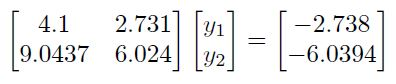
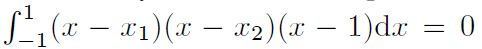

# Exam HS20

## Exercise 1
We want to solve the linear system `A_s*x = b` with A_s (element of) R^(nxn) and symmetric and positive definite.

### Exercise 1a
Consider the iterative method described by the recursive definition:

where `delta > 0` is a real parameter, while r(k) is the residual at iteration k, and x(k+1) is the approximation of
the solution x to be computed at the present iteration.

#### Exercise 1a.1
Write the pre-conditioner matrix P of the iterative method. Is it a stationary or dynamic method?
Briefly justify (max 30 words) your answer.

#### Exercise 1a.2
Find the conditions on delta (in the form delta < ... and/or delta > ... , etc.) for which the iterative method
converges to solve the linear system `A_sx = b`.

*Hints:*
- If A is symmetric positive definite, its eigenvalues satisfy lambda_1 > lambda_2 > ... > lambda_n > 0;
- The eigenvalues of a matrix `I - alpha*B` are `1 - alpha*lambda*(B);
- To satisfy |x| < beta, two conditions should be satisfied: min(x) > -beta and max(x) < beta.

### Exercise 1b
In the MATLAB script `ex_delta.m`, use the iterative method to solve the linear system:

using 7 different values of delta, equally-spaced between delta = 4.75 and delta = 7.75 (included among the 7 values).

#### Exercise 1b.1
Implement the iterative method for a given value of delta in a MATLAB function delta iteration. It
stops when the norm-2 of the absolute residual is smaller than 10^-8, it performs maximum 100 iterations
and it prints a message on screen if it does not converge.
The prototype is `[xx, it, err hist]=delta_iteration(A, b, x0, delta)`, where

| Input| |
| ------------- | ------------- |
| A | Matrix of the linear system |
| b | Known vector of the linear system |
| x0 | Initial guess |
| delta | Parameter delta (scalar value) |

| Output| |
| ------------- | ------------- |
| xx | computed solution (column vector) |
| it | Performed iterations |
| err_hist | Error history vector containing the norm-2 of the absolute residual at all iterations |

#### Exercise 1b.2
Use the function above to solve the given linear system for the seven values of delta, using a null vector
as initial guess. Store the results for each value of delta.

#### Exercise 1b.2
For each value of delta, plot the error versus the iterations. Use a thicker line for the value of delta corresponding
to the optimal ones among the runs.

### Exercise 1c (Bonus)
Consider the linear system (not symmetric positive definite):

whose exact solution is y = [-2,2]^T. Suppose that, using some direct method, the numerical solution we
obtain is y_tilde = [-0.667,-0.0012]^T. The residual has components approximately O(10^-5), so it is pretty
small, but the error on the solution is unacceptably large. How do you explain this result? (Max 100 words).

## Exercise 2
A planet's space coordinates can be expressed by the function:

### Exercise 2a
Assume to approximate f(x) with a Taylor series expansion, from the base point `a=pi/2` , for `x = [0, pi]`

#### Exercise 2a.1
Determine, by writing MATLAB `ex_space.m`, the lowest order pmin of Taylor series expansion that provides
a maximum absolute error of 0.015 in the given interval discretized by 100 equally-spaced points. The
error on a point xi is `E_p(xi) = |f(xi) - f_hat_p(xi)|` where f_hat_p(x) is the Taylor series of order p:

*Hints:*
- Derivatives of trigonometric functions:

- Do not test approximations higher than sixth order

#### Exercise 2a.2
Plot the errors E_p(x) versus x (element of) I = [0,pi] computed in exercise 1a for all p from 0 to pmin (or up to 6 if
you do not know pmin). Add to the plot an horizontal black, dashed line corresponding an error of 0.015.

#### Exercise 2a.3 (Bobus)
Bonus. Is it possible to reproduce exactly the given function with a Taylor series? If yes, how many
terms would be needed? Justify briefly (max 50 words) your answer.

### Exercise 2b
Now, we want to approximate thefirst order derivative of the given function in a point x_bar (element of) [0,pi], by using
the forward finite difference formula, which is denoted delta_positive_f(x_bar).

#### Exercise 2b.1
Consider the general error estimation `|f'(x_bar)-delta_positive_f(x_bar)| = h^p*M`, where h > 0 is a suffciently small distance, specify the expression of M and the value of p for the example under consideration. Explain also briefly
(max 30 words) under what conditions the given estimate holds.

#### Exercise 2b.2
In the script ex space.m, compute the forward finite difference formula of f(x) given in the function above at `x_bar=pi/4`.
- Start from h = 1, then progressively divide the step size h by a factor of 10 until 10^-15;
- Generate a plot of the error `|f'(x_bar)-delta_positive_f(x_bar)|` versus the step size h.
- For which value of h (approximately) the round-off starts to dominate the truncation error?
- Add to the plot, an estimate behavior of the truncation error in the interval.

### Exercise 2c
We want to solve f(x) = 0 with the secant method.

#### Exercise 2c.1
Write a MATLAB function secant solver that implements the secant method to find the zeros of a non-linear function, by using a stopping criterion based on the absolute difference between two subsequent
iterates. The functions prototype is `[x, it] = secant solver(fun, guesses, tol)`, where

| Input| |
| ------------- | ------------- |
| fun | Handle of the function to be solved |
| guesses | Column vector [x0,x1]^T |
| tol | tolerance for the stopping criterion |

| Output| |
| ------------- | ------------- |
| x | Computed root |
| it | Performed iterations |

Set a maximum of 100 iterations and at each iteration evaluate the function fun **only once**.

#### Exercise 2c.2
In the script ex space.m, call the secant method implemented in point c.1 to compute the zero alpha of the
given function. Use x(0) = pi and x(1) = 3 and set tol = 10^-12. Then, plot the function f(x) in the
interval [0,pi] using 100 evaluations points, along with the computed alpha as a red circle. Write in the figure
title the number of performed iterations, by using
`title(sprintf('Root of f(x) computed in %d iterations',it))`.

## Exercise 3
Let Q be the quadrature formula over [-1,1] for f(x) defined as

where gamma_1, gamma_2, and gamma_3 are real parameters, and x1, x2 are x values such that -1 <= x1 < x2 < 1.

### Exercise 3a
We want to study the properties of Q in terms of gamma_1, gamma_2, and gamma_3, x1, and x2.

#### Exercise 3a.1
Define alpha_j , xj and n, so that the quadrature can be written as

#### Exercise 3a.2
Show that (or explain why), for the given (x1, x2), there exists a unique set (gamma_1, gamma_2, and gamma_3) that provides a degree of exactness of at least 2. Explain how you could find these gamma_i.

*Hints:*
There are different ways to answer this question. For one of them, it can be useful to know that a
matrix in the shape

#### Exercise 3a.3 (Bonus)
Bonus. Now, we assume that Q is at least of degree of exactness 2. If, in addition to the ones previously
given, the condition 

holds, we can guarantee that Q has degree of exactness at least 3. Explain why this is true. Note that 
`omega(x) = (x-x1)(x-x2)(x-1)` is a nodal polynomial.

#### Exercise 3a.4
With the conditions given above, we can reach up to a degree of exactness of 4. Suppose now that you
are free to choose any three quadrature nodes, also different from (x1, x2, 1). Propose three nodes that
provide a degree of exactness of 5. Justify your answer (max 50 words).

### Exercise 3b
Now, consider the nodes

#### Exercise 3b.1
Following your answer in (a.2), compute the values of gamma_1, gamma_2, and gamma_3 and store them in a vector `gammas`.

#### Exercise 2b.2
Write a MATLAB function `gammaQuadr.m` that computes the quadrature Q given as inputs x1, x2, the vector
`gammas` and the function evaluations f(x1), f(x2) and f(1).
Note: instead of a file `gammaQuadr.m`, you can define a local function in script `ex_gammas.m`.

### Exercise 3c (Bonus)
We want to find the interpolation polynomial of degree 3 of a function f(x), which
uses as interpolating nodes x1, x2 and 1 and satisfies

where Q is the quadrature defined in exercise 3b.
If you have not solved exercise 3b, use Q = 1.16.

#### Exercise 3c.1
Write a MATLAB function `FindInterp.m` that given as input x1, x2, the function evaluations f(x1), f(x2)
and f(1) and the value Q, returns as outputs the coefficients

sorted along the decreasing powers
they are associated to.

#### Exercise 3c.2
Compute

for the function `f(x) = 1-exp (x - 1)` and print on screen its expression with coefficients
rounded at the second decimal digits.

#### Exercise 3c.3
Plot on a single figure the function f(x) and the interpolating polynomial 

over the interval [-1,1] sampled at 100 points. Add to the plot circles marks indicating the used nodes.
