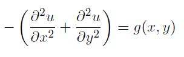
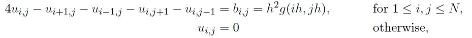
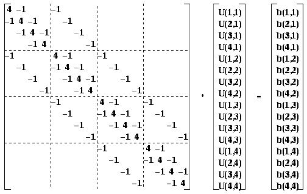
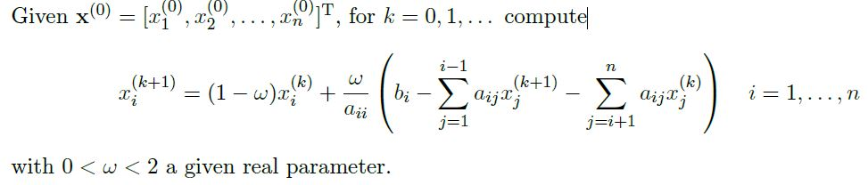

# Exercise Session 10

[Link to Exercise Session 10](https://github.com/dastal/Numerical_Methods_in_Informatics/tree/master/Exercise%20Sessions/Exercise%20Session%2010)

## Introduction to Poisson's Equation
Poisson's equation arises in several physical problems, such as heat flow, electrostatics, gravity. In
2-dimensions, in its simplest form, the equation reads:

where u(x,y) is the unknown function that we want to compute and g(x,y) is a given source, i.e.
a known, prescribed function. The solution is sought in a region Omega of the (x,y) plane, and its well
definition is ensured by so-called boundary conditions. Those boundary conditions are prescribed
here as the value of u(x,y) on the boundary of Omega (boundary usually denoted delta_Omega).

In this exercise session, we consider the source function as

`g(x,y) = 1.25*exp(x+y/2)`

and the computational domain as the unit square:

`Omega = [0,1] x [0,1]` i.e. `0 < x,y < 1`

We also consider the following boundary conditions:

- `u(0,y) = exp(y/2)` for `x = 0` (left boundary)
- `u(1,y) = exp(1 + y/2)` for `x = 1` (right boundary)
- `u(x,0) = exp(x)` for `y = 0` (lower boundary)
- `u(x,1) = exp(x + 1/2)` for `y = 1` (upper boundary)

## Numerical Approach to the Poisson's Equation
To solve numerically this problem, we can introduce a discretization: we represent the unit square
as a grid with N internal points per edge. We do not set nodes on the boundary as there the
solution is already known.

This grid is characterized by its width `h = 1/(N + 1)`, the number of nodes being identical along
each direction x or y. Thus, the nodes (i,j) has for coordinates `xi = i*h` and `xj = j*h`.
Discretizing this equation with centered differences over the N x N grids, we have

where u(i,j) is the nodal values of u(x,y), i.e. u(i,j) = u(xi,j) = and b(i,j) = h^2g(xi,yj).

These relations can be expressed as a linear system Au = b, where u is a vector containing all the
N^2 unknowns {u(i,j)}^N_(i,j=1). To write the previous equations in a matrix form, we need to establish
an ordering of the vector u. There are different possibilities, one is the so called lexicographical
order, which stores first all {u(i,1)} = 1^N, then {u(i,2)} = 1^N, and so on until {u(i,N)} = 1^N. The
same order is reflected on b. The resulting matrix A is the sparse N^2 x N^2 matrix represented here.

## Exercise 1
Build the matrix form of the Poisson's equation.

### Exercise 1a
Generate one vector describing the x and y spacing vector of the mesh.

### Exercise 1b
Generate the mesh from this vector by using the MATLAB command meshgrid.

### Exercise 1c
Plot the mesh by depicting the cell edges in blue and the nodes in red.

### Exercise 1d
Build the known term b given the generated matrices as an output of meshgrid, the source
function and boundary conditions.

### Exercise 1e
 the MATLAB commands reshape to form the vector b.
 
### Exercise 1f
Write a routine the generate the matrix A for a given N.

### Exercise 1g
Compare your results with the MATLAB command `A=gallery('poisson',N)`.

## Exercise 2
Consider the Successive over-relaxation (SOR) iterative method reading as follows.

### Exercise 2a
Write a function called `relaxmeth.m` that implements this iterative method according to the
following input and output specifications. Stop the iterations when the relative increment
`norm(delta_l)/norm(b)` is less than a given tolerance epsilon.

| Input| |
| ------------- |-------------|
| A | Square Matrix |
| b | Vector of known values |
| x0 | Initial guess |
| nmax | Maximum number of iterations |
| tol | Value epsilon for the stopping criteria |
| omega | Relaxation parameter omega |

| Output| |
| ------------- |-------------|
| x | Solution |
| iter | Number of iterations |

### Exercise 2b
Use the previous function to solve the Poisson problem with N = 20 using `omega = 2 / (1+sin(pi*h))`

### Exercise 2c
Define the exact solution `u_ex(x,y) = exp(x + y/2)` as an anonymous function and obtain the
error between the solution's approximation and the exact value.

### Exercise 2d
Reshape the result over the 2D mesh and plot it alongside with the exact solution (using
subplot). Play around the MATLAB commands `contour3`, `plot3`, `contour`, `mesh`, `meshc`,
`surf` as ways of plotting and visualizing result.

### Exercise 2e
Repeat the two first questions over several values of omega (typically ranging from `1+1e-5` to
`2-1e-5`). Store the obtained error in a matrix where the rows correspond to each iteration
step and the columns to omega.

### Exercise 2f
For each omega, derive the convergence order of the SOR method. Plot then the convergence
order against omega. What do you observe?

### Exercise 2g
Give an approximate value of the optimal omega by analyzing the plot.
