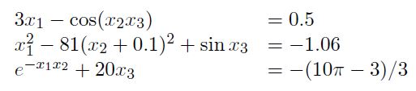
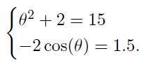
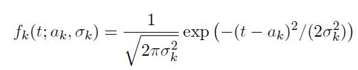
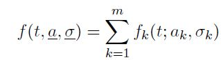
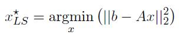
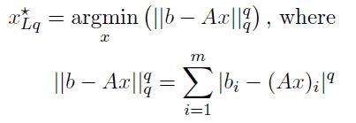
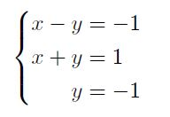

# Exercise Session 13

[Link to Exercise Session 13](https://github.com/dastal/Numerical_Methods_in_Informatics/tree/master/Exercise%20Sessions/Exercise%20Session%2013)

## Exercise 1
Consider the following nonlinear system

### Exercise 1a
Write a MATLAB routine that implements the Newton's method to solve a system of non-linear
equation, taking as inputs two function handles, one for the function and one for the Jacobian.
Stop the algorithm when the euclidean norm of the difference between consecutive iterations is
below an input threshold `tol`.

### Exercise 1b
Which are the conditions under which the algorithm implemented in point a. is expected to
converge?

### Exercise 1c
Solve the given systems with initial guess x(0) = [0.1,0.1,-0.1]^T and tol = 1 * 10^-8. Report
the solution and the number of iterations.

## Exercise 2
Apply the Gauss-Newton method to the following problems.

### Exercise 2a
Find the least-square approximation to Teta to the system

### Exercise 2b: Signal analysis
The signal intensity is modeled as a sum of m Gaussian functions (also called
peaks)

given a set of expected values ak and of standard deviations sigma_k, we set

Set m = 5 and set a = [2.3, 3.25, 4.82, 5.3, 6.6], and sigma = [0.2, 0.34, 0.50, 0.23, 0.39]. Generate some
noisy signal adding to the function f a random normal noise multiplied by 0.05 (`0.05*randn(size)`).
Starting now from some initial values a = [2, 3, 4, 5, 6] and sigma = [0.3, 0.3, 0.6, 0.3, 0.3] as initial guess,
use the Gauss{Newton algorithm to recast the original signal.

## Exercise 3: Additional Content (Not Part of the Exam), Fixed point iteration for a "Least q-norm" problem solving

- The Least Square method applied for an over-constrained linear problem consists in finding the minimum of the 2-norm of the residual of the system Ax = b, where A (element of) R^(m xn ), x (elemdent of) R^n, b (element of) R^m. m is the number of equation and n is the number of unknown. m > n hence the over-constrained problem.
Here we have:

- Here we want to minimize not the least square but the least q-norm.

### Exercise 3a
Compare the different unit circles norm(x)(q,q) = 1 in the 2D plane, for various q values (for instance
[0, 0.5, 1, 1.5, 2, 3, 5, inf]). Comment on the influence of q for the following over-constrained system
solving (graphical interpretation in another plot):

### Exercise 3b
Derive a fixed point method iteration for solving the problem, using a differentiation of the cost
function.

### Exercise 3c
Write a MATLAB routine that implements this fixed point iteration to solve the previous over-
constrained problem. For this, create a function taking as inputs A, b, q, an initial guess x0, a
maximum iteration itMax, the required tolerance TOL.
You can check your results using the MATLAB embedded function `fminsearch(fun,x0)`.

### Exercise 3d
Comment on the behavior of the fixed point iteration method with q smaller than 1 or bigger
than 3. Explain qualitatively this behaviour, using a 1D graphical interpretation of the iterated
function.
