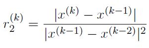
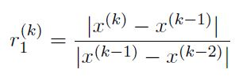

# Exercise Session 3

[Link to Exercise Session 3](https://github.com/dastal/Numerical_Methods_in_Informatics/tree/master/Exercise%20Sessions/Exercise%20Session%203)

## Exercises 1 and 2
Homework correction

## Exercise 3
Bisection Method

Let us look for the zeros of given functions, representing the solution of non-linear equations. The
method employed here is the iterative method called bisection.

### Exercise 3a
Define a function called `Bisection.m` that implements the bisection method to solve a nonlinear equation according to the following input and output values.

| Input| |
| ------------- |-------------|
| fun | Function handle of f(x) |
| x0 | Initial value x0 |
| x1 | Initial value x1 |
| eps | Prescribed convergence tolerance |

| Output| |
| ------------- |-------------|
| x | Approximated result |
| it | Number of performed iterations |

- Stop the algorithm when the considered interval is such that `(bk-ak)/2 < eps`
- Set a maximum number of iterations to avoid the possible infinite loops in your script.
- Before return, if successful, the routines prints a message to inform the user. If it has reached the prescribed convergence criterion , it outputs the number of iterations performed in a formatted sentence (e.g. "The number of iteration required to achieve the tolerance 10^-8 is 200"). Otherwise, it prints an error message.

### Exercise 3b
Write a script file named Root bisection.m which uses the function Bisection of point (a)
to compute the zero of the function `f1 = exp(-(x-1)^2)+10*(1-x)^4-4*x^3+5` in the
interval [0,2]. More precisely,

- Test your function with over the interval x0 = 0 and x1 = 2 with as convergence tolerance `epsilon = 10^-8`.
- Print out in the console the number of iterations that were required to achieve this accuracy.
- generate a plot with the value of function f1 in the interval `-5 <= x <= 5`. Add to the plot a mark for the root you have just found. Add legend and label.

### Exercise 3c
Write a script file named `Roots_bisection.m` which uses the function Bisection of Exercise 3a
to compute the zeros of the function `f1 = 2*cos(3x)-exp(x)`. More precisely,

- test your function with initial guesses x0 = 0 and x1 = 2, with a convergence tolerance `epsilon = 10^-8`.
- generate a plot with the value of function f1 in the interval `-5 <= x <= 5`. Add to the plot the mark for each of the root you have just found. Add a legend and a label.

## Exercise 4
Newton Method

### Exercise 4a
Write a routine which implements the Newton's method, saving in a vector all approximate (intermediate) results, i.e. all x(k). It can take the following input and output

| Input| |
| ------------- |-------------|
| fun | Function handle of f(x) |
| ffun | Function derivative handle of f(x) |
| x0 | Initial value x0 |
| eps | Prescribed convergence tolerance |
| itMax | Number of maximum iterations |

| Output| |
| ------------- |-------------|
| x | Approximated result |
| it | Number of performed iterations |
| xx | Vector that contains all computed x(k) |

### Exercise 4b
test the routines on the following functions (convergence `epsilon = 5.0*10^-5`):
- `f1 = x2 - 9`, with initial guess x0 = 0.1,
- `f2 = (x - 4)^2`, with initial guess x0 = 0.1,
- `f3 = tanh(x)`, with initial guess x0 = 20 (the derivative is `f'3(x) = 1 - tanh(x)^2` ).

### Exercise 4c
Check the convergence rate for f1, by plotting the quantity

From the theory, we can expect a quadratic convergence, so the quantity r2 should approach
a nonzero constant as `k -> inf.`. Does it happen? *Hint*: after plotting, "zoom in" on the region
close to the last iterations.

### Exercise 4d
Check the convergence rate for f2, by plotting the quantities r2 and also

which is representative of a linear convergence. What can you say about the convergence rate
of Newton's method in this case? Can you justify your findings?

### Exercise 4e
What can you say about the application of the Newton method to solve f3?
