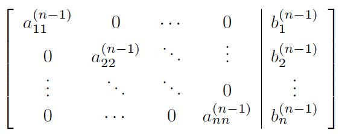
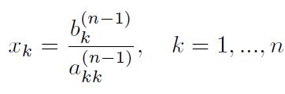
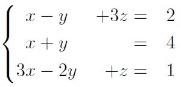

# Exercise Session 8

[Link to Exercise Session 8](https://github.com/dastal/Numerical_Methods_in_Informatics/tree/master/Exercise%20Sessions/Exercise%20Session%208)

## Exercise 1: Gauss-Jordan Method
The Gauss-Jordan method used to solve linear system can be described as follows. Augment A by the right-hand-side 
vector b and proceed as in Gaussian elimination, except use the pivot element a_kk(k-1) to eliminate not only 
a_ik(k-1) for i = (k+1), ... ,n but also the elements a_ik(k-1) for i = 1, ... ,(k-1), i.e., all elements in the kth 
column other than the pivot. Upon reducing (A|b) into

the solution is obtained by setting

This procedure circumvents the backward substitution part necessary for the Gaussian elimination algorithm.

### Exercise 1.1
Write a Matlab function `x=GaussJordan(A,b)` for this Gauss-Jordan
procedure. You may assume that no pivoting (i.e., no row interchanging) is
required.

### Exercise 1.2
Show that the Gauss-Jordan method requires `n^3+O(n^2)` floating point operations for one right-hand-side vector b - 
roughly 50% more than what's needed for Gaussian elimination.

## Exercise 2: LU decomposition
An electronics company produces transistors, resistors, and computer chips.
Each transistor requires 6 units of copper, 2 units of zinc, and 4 units of glass.
Each resistor requires 6, 3, and 5 units of the three materials, respectively, and
each computer chip requires 2, 1, and 4 units of these materials, respectively.

### Exercise 2.1
The available amount of material vary from week to week, so they need
to schedule different production each week. Indicate the weekly available
amount of copper, zinc, and of glass as bc, bz,and bg, respectively. Then,
answer the following request:

- Write the matrix form of linear system of equations that can be solved to compute how many items of each product can be produced with the available material: Ax = b (x being the quantities of each product that can be made)
- Under which conditions the linear system is solvable?
- Which is a suitable solution strategy to take into account that the available material changes every week?

### Exercise 2.2
Calculate the 1-norm and inf-norm of the matrix A.

### Exercise 2.3
Verify that all principal sub-matrices are non-singular.

### Exercise 2.4
Calculate by hand the LU decomposition of the matrix of the
system defined in Exercise 2.1. Show the process step by step.

### Exercise 2.5
Use the LU decomposition to compute the determinant of the matrix of
the system.

### Exercise 2.6
How many items of each product can be made if the following amount of
material is available (Use the Matlab backslash `\` for the solution of triangular system 
(do not implement forward/backward substitution here):
- 210 units of copper, 95 units of zinc, and 235 units of glass.
- 220 units of copper, 105 units of zinc, and 190 units of glass.

## Exercise 3: Gauss-Elimination
Consider the problem:

Carry out Gaussian elimination in its simplest form for this problem. What is
the resulting upper triangular matrix?
Proceed to find the solution by backward substitution.
