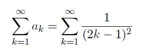
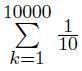
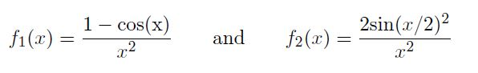
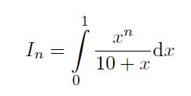
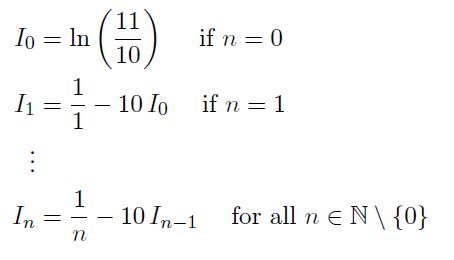

# Homework 1

[Link to Homework 1](https://github.com/dastal/Numerical_Methods_in_Informatics_II/tree/master/Homework%201)

## Exercise 1
Consider the following series:



### Exercise 1a
Write a script called `series.m` which:
- finds the first 10 values of the partial sums An of the series for n = 1, ... , 10
- plots these values as discrete points (no lines between them);
- adds your name as a title on the top of the plot;
- adds labels for the x and y axes;
- saves automatically the plot in `series_plot.fig`;
- closes the figure.

### Exercise 1b
The series converges to `A = pi^2/8` . Build a function `tolerance_series.m` that takes as input a tolerance epsilon and stops the partial sums An when the error `|An-A|<=epsilon`. The output is the first n such that `|An-A|<=epsilon`.

| Input |  |
| --- | --- |
| eps | tolerance |

| Output |  |
| --- | --- |
| n | first n such that `|An-A|<=epsilon` |

### Additional Exercise 1c
Use the routine developed in point Exercise 1b with epsilon = 0.0015. Generate a new plot of the values of An, for n from 1 up to the number of iterations just computed (for epsilon = 0.0015), along with the actual limit of the series.

## Exercise 2
We want to investigate the impact that the numerical errors have on the obtained results depending on the order in which the operations are performed.

### Exercise 2a: Impact of the rouding error
Write a script `Rounding.m` computing numerically the value of



The script should:
- compute the sum in a loop and store the result in the variable resL
- compute the sum without using loop (in a vectorisation spirit) and store the result in the variable resV
- knowing that the exact value is 10^3, evaluate the relative error of both computations methods, and store them respectively in the variables errvec and errloop.

### Exercise 2b Impact of cancellation errors
We want to study the impact of cancellation error when evaluating numerical expressions. To this aim, we define two expressions that are algrebraically equivalent but yield different behaviors in the vicinity of a given point, and witness the impact of the chosen expression in the accuracy of the obtained result.
Write a script `CancellingErrors.m` that

- defines the two functions as anonymous functions with handles f1 and f2 (note that algebraically f1 = f2)



- defines a vector h of points in the vicinity of 0, containing in decreasing order the values 10^-16, 10^-8, 10^-5, 10^-4, 10^-3, 10^-1
- plots on a same figure the values of f1 and f2 evaluated at each point of the vector h
- sets a label, a title, a legend and saves the figure with the name `ComputationErrors.fig`.
- Additional Point: How do you explain the observed behavior?

### Exercise 2c Error by numerical instabilities
We want to compute the value of the integral



for various values of n element of IN. Algebraically, we know that the values can be obtained through the recurrence relation



where ln denotes the natural logarithm.

Knowing that the first values are exactly given by:

```
Iex0 = log(11/10);
Iex1 = 1+10*(log(10)-log(11));
Iex2 = -19/2 + 100*log(11) - 50*log(100);
Iex3 = 286/3 + 1000*(log(10)-log(11));
Iex4 = -11437/12 - 10000*(log(10)-log(11));
```

write a script `Instabilities.m` that

- computes the absolute error `|In-Inex|` of the recurrence method for n = 0, 1, 2, 3, 4 and saves the results as a vector in the variable err
- plots the error against n in a labeled and titled figure
- saves the figure as `InstabilitiesError.fig`
- plots the error against n with a semilogy scale in a labeled and titled figure
- saves the figure as `InstabilitiesErrorSemilogy.fig`
- Additional Point: Explain the obtained graphs.

### Additional Exercise 2d
Write a script `ReduceErrors.m` in which you propose another computation method, reducing the computations errors, for the quantities discussed at points Exercises 2a and 2c. Print out the obtained values and errors using your method.

## Additional Exercise 3
Let us look for the zeros of given functions, representing the solution of non-linear equations. The method employed here is the iterative method called bisection.

### Exercise 3a
Define a function called Bisection.m that implements the bisection method to solve a non-linear equation according to the following input and output values.


| Input |  |
| --- | --- |
| fun | function handle |
| x0 | initial value x0 |
| x1 | initial value x1 |
| eps | prescribed convergence tolerance |

| Output |  |
| --- | --- |
| x | approximated result |
| it | number of performed interations |

- Stop the algorithm when the considered interval is such that `(bk-ak)/2 <= eps`
- Set a maximum number of iterations to avoid the possible infinite loops in your script.
- Before return, if successful, the routines prints a message to inform the user. If it has reached the prescribed convergence criterion , it outputs the number of iterations performed in a formatted sentence (e.g. "The number of iteration required to achieve the tolerance 10^-8 is 200"). Otherwise, it prints an error message.

### Exercise 3b
Write a script file named `Root_bisection.m` which uses the function Bisection of point Exercise 3a to compute the zero of the function `f1 = @(x) exp(-(x-1).^2)+10*(1-x).^4-4.*x.^3+5` in the interval [0, 2]. More precisely,

- Test your function with over the interval x0 = 0 and x1 = 2 with as convergence tolerance epsilon = 10^-8
- Print out in the console the number of iterations that were required to achieve this accuracy.
- generate a plot with the value of function f1 in the interval -5<=x<=5. Add to the plot a mark for the root you have just found. Add legend and label.

### Exercise 3c
Write a script file named `Roots_bisection.m` which uses the function Bisection of point Exercise 3a to compute the zeros of the function `f2 = @(x) 2*cos(3*x)-exp(x)` More precisely,

- test your function with initial guesses x0 = 0 and x1 = 2, with a convergence tolerance epsilon = 10^-8
- generate a plot with the value of function f1 in the interval -5<=x<=5. Add to the plot the mark for each of the root you have just found. Add a legend and a label.
