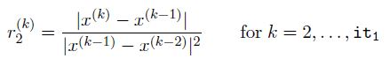
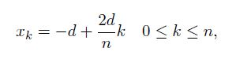
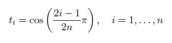

# Homework 2

[Link to Homework 2](https://github.com/dastal/Numerical_Methods_in_Informatics_II/tree/master/Homework%202)

## Exercise 1
We want to implement and investigate the Newton's method.

### Exercise 1a
Write the function `NewtonMeth.m` that implements the Newton's method, saving in a vector all
approximate (intermediate) results, i.e. all x(k). Use a stopping criteria based on the absolute
distance between the last iterations. The function should have the following input and output

| Input |  |
| --- | --- |
| fun | funciton handle |
| dfun | derivation funciton handle |
| x0 | initial value |
| itMax | number of maximum iterations |
| eps | prescribed convergence tolerance epsilon |

| Output |  |
| --- | --- |
| x | approximated result |
| r | residual at the last iteration |
| it | number of performed iterations |
| xxs | vector containing all computed x(k).|

### Exercise 1b
Write a script `PlotZeros.m` that tests the routine written in Exercise 1a. Use the functions:

- `f1 = x^9-9` with initial guess x0 = 0.1,
- `f2 = (x-4)^2` with initial guess x0 = 0.1,
- `f3 = tanh(x)` with initial guess x0 = 2.0,

using the convergence tolerance epsilon = 5 * 10^-9 and 1000 max iterations. In addition to the calls to `NewtonMeth.m`, the script plots on the same figure `FoundZeros.fig`:
- with lines, the three functions f1, f2, f3, for -2 <= x <= 5;
- with markers, the zeros found with the Newton method, if it converged.

### Exercise 1c
Write a script `Convergence.m` that checks the convergence rate for f1 by plotting in the figure `PlotConvF1.fig` the quantity



against k, where it1 is the number of iterations performed by the Newton method to solve f1.
From the theory, we can expect a quadratic convergence, so the quantity r2 should approach
a nonzero constant C1 as k -> 1. Does it happen? If yes, add a line to the script to print on
screen its approximated value with 4 decimal digits.

### Exercise 1d
Let's check the convergence rate for f2. Add to the script `Convergence.m` the commands to plot in logarithmic scale in the figure `PlotConvF1.fig`
- the error at the iteration k (on the x axis) versus the error at the iteration k + 1 (on the y axis), where the error is defined for k = 0, ..., it2-2 (where it2 is the number of iterations performed by the Newton method to solve f2) as the distance between x(k) and the computed zero.
- the (dashed) lines corresponding to the orders of convergence p = {1, 2, 3, 4}. Hint: to plot them, you can use as abscissas the same errors as before, and as ordinates the errors you would have if the methods converged with order p.
- Additional Point: What can you say about the convergence rate of Newton's method in this case? Can you justify your findings?


### Exercise 1e
Write a script `nonLinearSolver.m` that performs 3 iterations with the bisection methods to find a better initial value for f3.
- For the bisection, use as initial interval [-1,2], the same convergence tolerance and 3 maximum iterations, and write the bisection method directly in the script `nonLinearSolver.m` (i.e., no calls to external functions).
- Then, use the found zero as initial value for the Newton method to solve f3, by calling the function `NewtonMeth.m` written in Exercise 1a.
- Print on screen a message that gives the solution, the number of iterations performed by the Newton methods and the residual.

## Exercise 2
This exercise concerns Lagrangian interpolation.

### Exercise 2a
Write a function called `LagranCharPoly.m` that builds the Lagrangian characteristic polynomials phi_k(x) of degree n for k = 0,...,n, given the set of nodes xi, for i=0,...,n. The input x(bar) is a vector of Nj points. The function prototype (or declaration) should be:

```function [phi] = LagranCharPoly(nodes, x)```

where phi is a Nj x (n+1) matrix containing [phi0(x)phi1(x)...phin(x)], nodes is the n+1-length vector of nodes xi, and x is the vector x(bar) of the points where you ask to evaluate phi_k.

### Exercise 2b
Consider the function `f(x) = exp(-x^2)` over the interval x (element of) [-d,d] (element of) (real Numbers), with d = 2. Write a script called test "interp.m" that, given the nodes



- computes the interpolation polynomials (Pi_n_f) for degrees n = 2,4,6,8,10 by using the function "LagranCharPoly.m" written in Exercise 2a.
- evaluates the polynomials (Pi_n_f) in the points `x_bar(j) = -d + 2*d*j/1000` for `0<=j<=1000` and plots all approximations, together with the function f(x_bar), in one plot
- completes the plot with labels, legend, and title, and saves it in a figure "fun_interp_n.fig"
- computes the error `En = max(0<=j<=1000) |(f - Pi_n_f)(x_bar(j)|`
- plots the error (semilog scale with n on the x-axis) in a plot along with the rates of convergence, saves the plot in a figure "err_interp_n.fig"
- Additional Point: uses the values of the errors computed at the previous point to derive (approximately) the constants p and C in the estimate `En <= Cexp(-p*n)` by averaging the values obtained for subsequent steps.

## Additional Exercise 3
Given the Runge's function `f(x) = 1/(1+25*x^2)` , for -1 <= x <= 1, compare the Lagrange interpolation of degree at most 4, 9, and 19 using n + 1 equidistant points, and using n + 1 Chebyshev nodes.

The formula for the Chebyshev Nodes is:



- Plot the three polynomials obtained with equidistant points and the function in a same figure
- Plot the three polynomials obtained with Chebyshev points and the function in a same figure
- Plot a figure for each degree n = 4, 9, 19 displaying the polynomial of degree n obtained with equidistant points, the one obtained with Chebyshev points, and the function.
