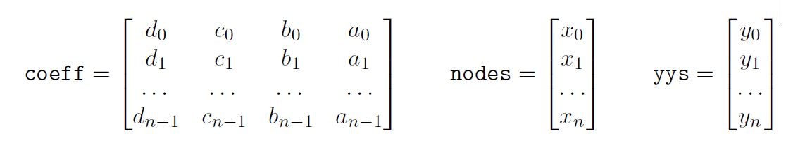
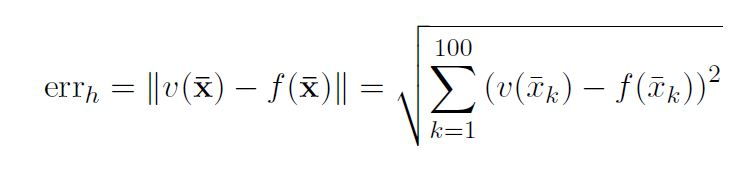

# Homework 3

[Link to Homework 3](https://github.com/dastal/Numerical_Methods_in_Informatics_II/tree/master/Homework%203)

## Exercise 1

### Exercise 1a
Write the function `naturalspline.m` that computes the 4n coefficients of the natural cubic spline in the form:

```si(x) = ai + bi(x - xi) + ci(x - xi)^2 + di(x - xi)^3```

```for i = 0,1,...,n-1```

The function prototype should be: function `[coeff] = naturalspline(nodes, yys)` where nodes and yys are column vectors containing respectively the n + 1 nodes {xi} and
value {yi}, and the output coeff is a n x 4 matrix containing the coefficients. The function `naturalspline` solves only a tridiagional system for the coefficients ci, which
can be solved by using the MATLAB command `\`. Then, the function computes all the other coefficients and stores them in the output matrix coeff, as



The function `naturalspline.m` solves only a tridiagional system for the coefficients ci, which can be solved by using the MATLAB command `\`. Then, the function computes all the other coefficients and stores them in the output matrix coeff.

### Exercise 1b
Write a script test `spline.m` that computes the natural spline interpolation v(x) of the function f(x) using the nodes 

```xi = x0 + h * i``` 

```for i = 0,...,n = (xN - x0)/h```

Consider h = 1 and
- use the function naturalspline to compute the natural spline v(x)
- evaluate the natural spline v(x) over 100 equidistributed points between x0 and xN.
- build on the same data-pairs the not-a-knot spline using the ad-hoc MATLAB command and evaluate it over the same set of evaluation points used before.
- plot in the figure PlotSplines.fig the function, the two splines and the nodes.

Then, use this natural spline v(x) to approximate also the derivatives of f(x). Thus, add to the same script the commands to

- build the derivative of the piecewise polynomial interpolation, v0(x), using the coefficients stored in coeff, i.e. do not call again the function naturalspline.
- evaluate the approximation v0(x) and the exact derivative f0(x) over 100 equi-distributed points between x0 and xN.
- plot in the figure `PlotDerivSplines.fig` the derivative and the approximation.

### Exercise 1c
Check the convergence of the natural spline for decreasing h. Write a script `convergence_spline.m` that builds the natural spline approximation of f(x) for three different values of
`h = {0.5, 0.25, 0.125}` to define the nodes as before: `xi = x0 +h * i`, with x0 = 0 and xN = 5.
In particular,

- build the vector of evaluation points x_bar with 100 equi-spaced points between 0.5 and 4.5,
- for each h, compute the natural spline of the function f(x) between x0 and xN using the function `naturalspline.m` implemented in Exercise, evaluate it in points contained in x_bar, compute and store the 2-norm of the error, defined as



- plot (in an appropriate scale) the errors over the values of h as a solid line plus markers in the figure `PlotErrorSplines.fig`
- add to the figure the (dashed) lines representing orders of convergence 2, 3, 4, and 5.

## Exercise 2
We want to approximate the behavior of this function

```g(x) = 0.05*sin(1000*x) + 0.5cos(pi*x) - 0.4*sin(10*x)```

in the interval [0, 1]. In order to study the slow scale trend of this function, we wish to find a low degree polynomial that approximates g in the least squares sense, starting from 50 data points corresponding to the function evaluation at 50 equidistributed points in the interval [0,1].

### Exercise 2a
In a script `testLS.m`, build the column vectors containing these nodes xi and data yi. Plot in the figure `PlotLS.fig` the linear piecewise (or broken line) interpolation for these data.

### Exercise 2b
Write a function `leastSquares.m` that computes the coefficients of the polynomial fitting the data {xi, yi} in the sense of least squares, using the normal equations. The function prototype is function `aas = leastSquares (xxs, yys, m)` where xxs and yys are the column vectors containing nodes and values {xi, yi}, and m is the degree of polynomial that approximates the data, e.g. `pm = a0+a1*x+a2*x^2+...+am*x^m`. The output aas is the vector of coefficients `[a0 a1 a2 ... am]^T`.

### Exercise 2c
In the script `testLS.m`, use the function `leastSquares.m` to compute the polynomial of degree 6 fitting data. Evaluate the resulting approximation over 100 equi-spaced points in the interval [0, 1] and add it to the fgure `PlotLS.fig`.

### Exercise 2d
Continuing the script `testLS.m`, use the built-in MATLAB functions to compute the not-a-not spline approximation using the same 50 data pairs created in Exercise 1a. Then, use the built-in MATLAB functions to compute a polynomial interpolation of degree 15 over equi-spaced nodes in the interval [0, 1] (generate the new data pairs as required). Add the evaluations of the spline over 100 equi-spaced points in the interval [0,1] to the figure `PlotLS.fig`.

### Exercise 2e
Compute and print on screen the norm-2 of the least square residual of the approximation computed at Exercise 2c.

### Additional Exercise 2c
Repeat the Ecercise 2a with d = 1. Then,
- compute the error `Edn = max(0<=j<=1000) |(f - Lnf(xBarj)|` and use these values to derive (approximately) the rate of convergence with respect to the number of nodes n
- find an approximate value of dmax, such that the error Edn decreases for increasing n
- plot the logarithm of the error for d = dmax=2 with respect to n and determine the constant p in the estimate `Edn <= C*e^(-p*n)`

## Additional Exercise 3
The weekly and the daily values of the stock prices of the company Facebook Inc.1 from Oct. 1, 2017
to Sep. 30, 2018 are reported in the attached files `StockPrices.csv` and `StockPrices_day.csv`,
respectively. In particularly, the former contains 52 entries, one for each week of the year; the latter
includes less than 365 entries, since stock prices are available only on working days.
First of all, load both data-sets in MATLAB, without modifying the input files. For instance, you
can load the weekly data-set by means of `csvread('StockPrices.csv',2,0)`, which skips the first
two lines of the input file (see the help).

### Exercise 3a
For the weekly data-set, compute the least-squares approximations of degree m = 1, m = 2,
and m = 4. Then, for each approximation, answer the following questions:

- Which are the coeficients a0, a1, ... , am of the approximating `fTilde(x) = a0 + a1x + ... + amxm`?
- Which is the maximum squared residual `( fTilde(xi) - yi)^2`?
- Which is the sum of square of the residual? Why is this number important for this method?

### Exercise 3b
Compute also the cubic spline interpolation of the weekly data-set. Produce a figure, that
includes the original points, the cubic spline, and the three least-square approximations.

### Exercise 3c
Compute the least-square approximations of degree m = 1, m = 2, and m = 4, and the
cubic spline also for the daily data-set. Produce a figure as in point (b) including all four
approximations.

### Exercise 3d
Look at the figures obtained in points (b) and (c). If you want to forecast the stock price
15 days (or 2 weeks) after the last day in the data-sets, which approximation would you use,
and why? What have you obtained? The actual value on Oct. 15, 2018 was 153.32, how can
you explain the differences from the data predicted and the actual value?
