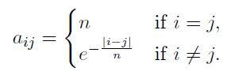
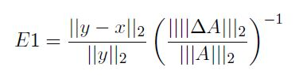
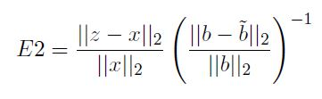
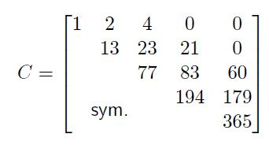
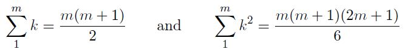

# Homework 4

[Link to Homework 4](https://github.com/dastal/Numerical_Methods_in_Informatics/tree/master/Homework%204)

## Exercise 1
Test numerically the computational complexity of the QR decomposition and of its application to the solution of the system of linear equations (in terms of number of floating point operations).

### Exercise 1a
Write a function called `qrsolve.m` that implements the QR decomposition of a given matrix A according to the following input and output specifications.

| Input| |
| ------------- |:-------------:|
| A | square matrix |

| Output| |
| ------------- |:-------------:|
| Q | orthogonal matrix of the QR decomposition |
| R | upper triangular matrix of the QR decomposition |

### Exercise 1b
Write a script called `qrcost.m` which uses the QR decomposition implemented before to solve the linear system Ab = x, where the elements of the matrix A element of R(n x n) are defined as:



and the right hand side vector is `b = [1, 0, 1, 0, ... , 1, 0]^T` element of R^n.

The script should, for n = 200, 400, 800, 1600, 3200
- assemble the matrix A and the vector b as defined above,
- compute the QR decomposition of A by using your qrsolve.m and save the required time,
- use QR decomposition to solve the given system and store the required time,
- plot (in an appropriate scale) the CPU time required by the QR decomposition and the total time (decomposition plus solution) for the different values n by using only marks,
- add to the plot the theoretical complexities of the two tasks as dotted lines,
- complete the plot with appropriate legend and axes labels.

## Exercise 2
A new delicatessen shop just opened in town, and proposes various sweets whose recipes are based
on only four ingredients: eggs, flower, cinnamon and milk. The four highlighted products are a
Gipfeli, a Strudel, a Luxemburgerli and a yogurt.
A primary school contacted the shop as they would like to organize a Halloween party. They
estimate the need of delicatessen to 32 Gipfeli, 23 Strudel, 33 Luxemburgerli and 31 yogurts.
As it is a huge order, the shop would like to know how much of material they have to collect prior
to the fabrication. Knowing that:

- a Gipfeli requires 10 units of eggs, 7 of flower, 8 of cinnamon and 7 of milk,
- a Strudel requires 7 units of eggs, 5 of flower, 6 of cinnamon and 5 of milk
- a Luxemburgerli requires 8 units of eggs, 6 of flower, 10 of cinnamon and 9 of milk
- a yogurt requires 7 units of eggs, 5 of flower, 9 of cinnamon and 10 of milk help them to estimate the amount of eggs, flower, cinnamon and milk they have to order.

1. Derive the system associated to the problem in order to find the required ingredients quantity x. (The system should have the form Ax = b with b being the vector of desired sweets quantities.)
2. Write a function `GetLU.m` that computes the LU factorisation of a given matrix. It should check if the method can be used on the given function, compute the factorisation and return the two triangular matrices L and U and their respective conditioning numbers.
- Within the function, you can use the implementation of the LU factorisation you did in the last exercise session or the Matlab command to get the lower and upper triangular matrices.
- If the given matrix is not valid for an LU factorisation, print an error message and abort the code.
- Use the following header:

| Input| |
| ------------- |:-------------:|
| A | The matrix to find the decomposition for |

| Output| |
| ------------- |:-------------:|
| L | The lower triangular matrix of the decomposition |
| U | The upper triangular matrix of the decomposition |
| cL | The conditioning number of the matrix L |
| cU | The conditioning number of the matrix U |

3. Write a function `Substitution.m` that implements the backward/forward substitution technique to find x given a problem `Ax = b` and a LU decomposition of the matrix A.

| Input| |
| ------------- |:-------------:|
| L | The lower triangular matrix |
| U | The upper triangular matrix |
| b | The column vector containing the desired sweets quantities |

| Output| |
| ------------- |:-------------:|
| x | The column vector containing the required ingredients quantities |

4. Write a script `HelpingBakery.m` that
- Defines the matrix A and the vector b associated to the bakery problem.
- Solves the above problem and prints out in the command window the quantities of each required material in the console output in the following format, using one line per ingredient

```
For the initial problem:
The required quantity of the Eggs is 10
The required quantity of the Cinnamon is 112.5
The required quantity of the Flower is 12
The required quantity of milk is 4.
```

The bakery is happy about your results but calls you back for an emergency: during the fabrication
process and due to the huge amount of baking, they could optimise the need of units per delicatessen:
the ingredients quantities they require have to be slightly adapted. Talking with them, you figure
out that instead of having to solve Ay = b, you have to consider the perturbed system `(A+deltaA)y = b`, where the slight ingredient changes are given in deltaA as

```
deltaA = [0 0 0.1 0.2;
          0.08 0.04 0 0;
          0 -0.02 -0.11 0;
          -0.01 -0.01 0 -0.02];
```

1. Add in the end of your script HelpingBakery.m a section that solves the system `(A+deltaA)y = b`
and prints out in the command window the new values contained in y in the format:


```
For the initial problem:
The required quantity of the Eggs is -10
The required quantity of the Cinnamon is 112.5
The required quantity of the Flower is 12
The required quantity of milk is -4.
```

2. The bakery is very surprised of this result and asks you explanations. To answer them, compute the amplification error E2 related to the perturbed vector b and the vector `y - x`:



Compute the conditioning numbers of A. Print out in the command window the values of E1 in a formatted sentence on the model:

```
The error E1 for the perturbed problem is: 1e-2.
The conditionining number of A is 1254.
```

Observe that E1 is lower than the conditioning number.

This time, the school contacted the bakery to inform them that they would like to have some sweetsof different size, yielding a desired amount of sweets as

```
bTilde = [32.1; 22.9; 33.01; 30.9];
```

1. Add in the end of your script `HelpingBakery.m` a section that solves the system `Az = bTilde` and prints out in the command window the new values contained in z in the format

```
For the perturbed problem:
The required quantity of the Eggs is 10
The required quantity of the Cinnamon is 112.5
The required quantity of the Flower is 12
The required quantity of milk is 0.2.
```

2. The bakery is surprised from this result and asks you further explanations. To answer them,
compute the amplification error E2 related to the matrix deltaA and the vector `z - x`:



Print out in the command window the values of E2 in a formatted sentence on the model

```
The error E2 for the perturbed vector problem is: 1e-2.
```

Observe that E2 is still lower than the conditioning number.

3. (Additional) Knowing that the conditioning number is giving you an upper-bound for the sensibility errors of the system Ax = b, with which confidence can you tell your obtained quantities to the bakery?

The bakery is now keener to accept your answers and asks you precise reasons of the earlier behavior.

1. (Additional) Retrieve the conditioning numbers of L and U and compare it with the one of A. Which matrix contains the most source of computational errors?

2. (Additional) Can you expect a better reliability of the result by the used LU technique rather than doing simply `inv(A) * b`?

## Additional Exercise 3
Cholesky factorization is a decomposition of a symmetric positive definite matrix into the product `R^T*R`, where R is an upper triangular matrix.

### Exercise 3a
Write a function called `cholDecomp.m` that implements the Cholesky factorization of a given matrix A using following input and output specifications.

| Input| |
| ------------- |:-------------:|
| A | Matrix |

| Output| |
| ------------- |:-------------:|
| R | R upper triangular matrix R |
| Rt | Rt lower triangular matrix R^T |

The function should, as first operation, check that the input matrix is square and symmetric. For this latter task, you may find the command any useful.

### Exercise 3b
Test your function `cholDecomp.m` to factorize the matrix



where sym. indicates that the remaining part of the matrix is built by symmetry. To build the matrix, use the commands `diag` and `triu`.

### Exercise 3c
Compute, at least at leading order, the complexity of the Cholesky algorithm. Remind that



### Exercise 3d
In the past weeks, we have studied the normal equations

[Normal Equations](Images/norm_eq_hw4_3d.JPG)

to solve the least-squares problem. If the matrix B element of R n x(m+1) has full column rank, the matrix `A = B^T*B` is a symmetric positive definite (with size n x n), so we can solve the linear system `Aa = B^T * y` by using the Cholesky decomposition. Try this approach to compute the coeficients of linear regression (m = 1) `v(x) = a0 + a1x` in the least-squares sense for the following data pairs (n = 6).

| xi| 0 | 1 | 2 | 3 | 4 | 5 |
| ------------- | ------------- | ------------- | ------------- | ------------- | ------------- | ------------- |
| yi | 0.1 | 1.4 | 2.1 | 2.8 | 3.9 | 5.1 |

### Exercise 3e
(Dificult task ) Instead of solving the system (1), a different approach aims to find directly the minimum of the rectangular system `norm(y-B*a)` using the QR factorization. Let's try to think how you can use the QR factorization (implemented in the MATLAB command `qr`) to solve the least square problem described in Exercise 3d.

### Exercise 3f
Compare and plot the results obtained by solving the normal equations with Cholesky factorization, by using `polyfit` and by solving the minimization problem with QR factorization.
