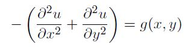
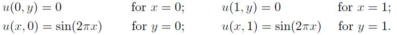
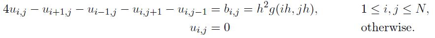
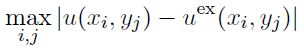
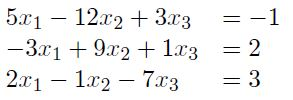

# Homework 5

[Link to Homework 5](https://github.com/dastal/Numerical_Methods_in_Informatics/tree/master/Homework%205)

## Exercise 1
The transverse displacement u of an elastic membrane from the reference plane z = 0, under a load
of intensity `g(x,y) = 8*pi^2*sin(2*x)*cos(2*y)` satisfies the Poisson problem:

in the unit square domain `Omega(x,y) = [0,1] x [0,1]`. The boundary conditions are

### Exercise 1a
Write a function called `gradmeth.m` that implements the gradient method to solve iteratively
the linear system `Ax = b`. As a stopping criterion, check the 2-norm of the residual normalized
with respect to 2-norm of the initial residual, i.e. `|r(0)|2`. Use the following prototype.
`[x,it,hist] = gradmeth(A, b, x0, tol, itMax)`, where

| Input| |
| ------------- |-------------|
| A | The matrix A |
| b | The known vector b |
| x0 | The initial guess |
| tol | The tolerance for the stopping criterion |
| itMax | The maximum number of iterations |

| Output| |
| ------------- |-------------|
| x | The computed solution |
| it | The number of performed iterations |
| hist | a vector containing the values of the error estimators used in the stopping criteria at every iteration `k = 1, ... ,it` |

### Exercise 1b
Write a script called `PoissonProbl.m` that assembles the linear system representing the discrete
version of the given Poisson problem as

where `ui,j` is the nodal values `ui,j = u(xi,yj) = and bi,j = h^2*g(xi,yj)`. The steps to build the linear system are
- Generate the square mesh with N = 20 internal points per edge. (Matlab: `meshgrid`)
- Build the known term b in lexicographical order. Hint: compute first `bi,j = b(xi,yj)` over the generated mesh and apply boundary conditions, then use the MATLAB command `reshape` to generate the vector b.
- Build the matrix N^2 x N^2 matrix A by using the available routines (developed during Exercise Session 9 ) or the MATLAB routine `gallery`.

**Note:** a correct execution of this task is fundamental to solve correctly the remaining points, but it will
not grant many points as it is almost identical to what seen during the Exercise Session 9, so please look
at the relevant scripts or pod-cast, if something is not clear.

### Exercise 1c
Add to the script `PoissonProbl.m` the instructions to solve the linear system built in Exercise 1b by using the function `gradmeth.m`.
- Use as initial guess a vector of zeros, 500 maximum iterations and tol = 10^-6.
- Store the history of the error estimates and the performed iterations.
- Plot the result `u(xi,yj)` over a 2D mesh (remind to leave the plot open).
- Compute the nodal relative error

- Print on screen the number of performed iterations and the nodal relative error in a formatted sentence like "The required number of iterations is 5000 and the obtained error is 1.5e-1". (Use the command `fprintf` to format the output.)

### Exercise 1d
Modify the function gradmeth.m by adding a logical variable flag as input, i.e., `[x,it,hist] = gradmeth(A, b, x0, tol, itMax, flag)` that, if true, modifies the step size computation. More specifically,

- if flag is `false`, the standard gradient method implemented before is used;
- if flag is true, the step size alpha_k is re-computed only every second step, i.e., for k even the standard formula `alpha_k = (r(k)^T*r(k))/(r(k)^T*A*r(k))` is used, and for k odd the already calculated alpha_(k-1) is used. For k = 1, you can use alpha_k = 1. In the following, we refer to this version as `even-odd`.

### Exercise 1e
Come back to the script `PoissonProbl.m`, and re-compute the solution of the Poisson problem
with the same parameters given in Exercise 1c using the even-odd version of the gradient method. Store
the history of the error estimates and the performed iterations.
Hint: to keep the old part of the script working, simply add a `false` flag to the call to the
function `gradmeth.m` implemented in point Exercise 1c.

### Exercise 1f
Add to the script `PoissonProbl.m`, the instructions to plot in semi-logarithmic y scale the
histories of the error estimators resulting from the standard and the even-odd version of the
gradient method (both in the same plot). Surprised?

## Exercise 2
Consider a sparse linear system `Ax = b` where A element of R^(50x50) is tridiagonal and symmetric with entries
equal to 2.001 on the main diagonal and equal to 1 on the first sub- and super-diagonals. We want to
solve this system with Gauss-Seidel method.

### Exercise 2a (Additional Point)
We can use the Gauss-Seidel method because we are sure it converges. Which feature of the matrix supports this statement?

### Exercise 2b
Write a function called `gaussSeidel.m` that implements the Gauss-Seidel method to solve the
linear system `Ax = b`, giving to the user the possibility to choose the stopping criteria stopCr:

- if `stopCr = 0`, the error estimator is the increment normalized w.r.t. to the initial guess,
- if `stopCr = 1`, the error estimator is the residual normalize wr.r.t to the vector b,
- otherwise, the function should rise an error.

*Hint*: use a suitable norm, if required.

The function prototype is `[xxs, it] = gaussSeidel(A, b, x0, tol, Nmax, stopCr)`, where

| Input| |
| ------------- |-------------|
| A | The matrix A |
| b | The known vector b |
| x0 | The initial guess |
| tol | The tolerance for the stopping criterion |
| Nmax | The maximum number of iterations |
| stopCr| An integer that determines the stopping criterion |

| Output| |
| ------------- |-------------|
| xxs | The matrix representing the history of x(k), storing in column k the iteration x(k) |
| it | The number of performed iterations |

### Exercise 2c
Write a script `sparseSys.m` that

- builds the sparse matrix A by using the MATLAB command `spdiags`. *Hint*: look at the version `A = spdiags(B,d,m,n)`.
- builds the right hand side vector b so that the exact solution is `x_ex = [1, 1, ..., 1]^T`.
- builds the initial guess x(0) with components `x0_j = 10*sin(100*j)` for `j = 1, ..., 100`.
- calls twice the function `gaussSeidel.m` to solve the system with both stopping criteria. Use in both cases, `tol = 10^-6` and maximum 1000 iterations.
- per each call, print on screen a one-line message similar to "Test on ... : it= ..., err=...", where the first dots are replaced by a word that specifies the used termination criteria (e.g. the word increment), and the other two are filled with the performed iterations and the final error (in norm-2).
- print on screen also the cheapest approximation of the conditioning number of the system matrix and the spectral radius of the iteration matrix.
- plots in a proper scale, the error behavior of both tests.
- **Additional Point:** Comment on the convergence results.

## Additional Exercise 3
Consider the Successive over-relaxation (SOR) iterative method to solve the following linear system

with initial guess `x(0) = b` and `epsilon = 0.0001`.

### Exercise 3a
build the iteration matrix B and compute the spectral radius for the set of values for `omega element of [0.01:0.01:2]`.

### Exercise 3b
plot a graph of the spectral radius of the iteration matrix vs. the parameter omega.

### Exercise 3c
Find the optimal relaxation parameter, omega*, within the given set and add its value as a red circular mark to the previous plot.
*Hint*: Look at the MATLAB commands `[M,I] = min(X)`, `[M,I] = max(X)`.

### Exercise 3d
to test your findings, build a vector `omegas = [omega-1; omega-0.5; omega; omega+0.5; omega+1]`
and compute the solution of the given linear system using the SOR method with the five different
omega values, saving also the history of the computed x(k).
*Hint:* create a big matrix `xxs=zeros(maxit, Ntest)` and for each test save its, so that you
can select the history of test p as `xxs(1:its(p), p)`.

### Exercise 3e
plot in `semilogy` the residuals for the different tests and use a thicker line for the one corresponding to omega.

### Exercise 3f
Approximately how much faster would the relaxation method with omega converge compared to
Jacobi?
