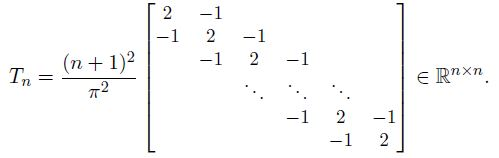
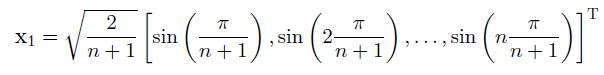
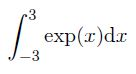

# Homework 6

[Link to Homework 6](https://github.com/dastal/Numerical_Methods_in_Informatics/tree/master/Homework%206)

## Exercise 1
We want to approximate the value of the integral of a given function `I(f) = (Integral from a to b) f(x)dx` using composite Newton-Cotes formulas, using M subintervals of uniform length `H = (b-a)/M`. Each subinterval Ik uses

- for the Simpson formula:

- for the trapezoidal formula:

### Exercise 1a
Write a function called `comp_simpson.m` that implements the composite Simpson formula, using
the following prototype:
`[Ic] = comp simpson(fun, xa, xb, M)`, where

| Input| |
| ------------- |-------------|
| fun | Function handle of f(x) |
| xa | Left extreme of integration domain, i.e. a |
| xb | Right extreme of integration domain, i.e. b |
| M | Number of Sub-Intervals |

| Output| |
| ------------- |-------------|
| IC | Approximate of the integral `I(f) = (Integral from a to b) f(x)dx` |

### Exercise 1b
Implement the composite trapezoidal rule in a function called comp trap.m, using the prototype
`[Ic] = comp trap(fun, xa, xb, M)`, where the variables are defined as in Exercise 1a.

### Exercise 1c
Test your quadrature functions with the function `f(x) = x^2*exp(-x)`, over the integration interval
`[a,b] = [0,3]`. Write the script `testQuadr.m` that
- calls the functions `comp_simpson.m` and `comp_trap.m` to compute the numerical approximations of the given integral `I(f) = (Integral from a to b) f(x)dx`, using a sequence of subintervals `M = 2^z` for `z = [1:7]`. Save the results in appropriate vectors.
- evaluates the numerical error for both composite quadrature formulas for all values of M, considering that the exact value of the integral is

- plots the errors in an appropriate scale, along with expect theoretical convergence rates
- finds the minimum number of subintervals Mmin for both composite formulas to have an absolute error less than 10^-5. Print of screen your results with a message similar to "To have err<=... with ... formula, we need h=... that is ... intervals", where the error is given in the %5:4e format, the used formula is a string, h is printed in the %8.6f format and the number of interval as an integer.

**Note**: the derivatives of the function f(x) up to fourth order are

## Exercise 2
The one-dimensional Sturm-Liouville eigenvalue problem models the vibration of a homogeneous string
of length pi that is fixed at both ends. Its discrete version, obtained by using finite difference formulas
and proper boundary conditions, can be expressed by the following eigenvalue problem

where Tn is the one-dimensional Poisson matrix:

The eigenvalues of the matrix Tn can be computed explicitly, and they are:

and 

We want to compute the smallest eigenvalue lambda_1 and corresponding eigenvector x1 for the case n = 40, with a variant of the power method.

### Exercise 2a
Write a function called `powershift.m` that implements the power method with shift (not inverse)
for the computation of the largest eigenvalue and its associated eigenvector of a general matrix
`A-alpha*I`, according to the following indications:

| Input| |
| ------------- |-------------|
| A | Square Matrix |
| alpha | Shift |
| tol | tolerance epsilon to stop the method when `|lambda(k) - lambda(k-1)| < |epsilon*lambda(k)|` |
| itMax | Maximum number of iterations |
| x0 | initial guess |

| Output| |
| ------------- |-------------|
| lambda | The approximation of lambda_1 |
| xx | The approximation of x1 |
| iter | Performed iterations |
| lambdas | All computed approximations of lambda_1 |

### Exercise 2b
If an upper bound `Tau` for the largest eigenvalue lambda_n of Tn is known, then we can compute the
smallest eigenvalue lambda_1 as the largest eigenvalue of the transformed matrix `T_hat_n = T-Tau*In` (where I is
the identity matrix of size n). Write a script `SL_eigen.m` that applies the function `powershift.m`
to solve the eigenvalue problem, with n = 40 and the shift `alpha = (4*(n+1)^2)/(pi^2)`. Set `tol=1.0d-10`
and `itMax=2500`, and use as initial guess `x(0) = [1, 2, ... , n]^T`.

### Exercise 2c
In the same script `SL_eigen.m`, add the commands to plot the error on the eigenvalue |lambda_k - lambda_1|
(in semi-log scale), along with the theoretical convergence rate, which is the square of ratio of
two largest eigenvalues in magnitude (*Hint*: pay attention to which eigenvalues play the role in
this power method with shift).

### Exercise 2d (Additional Point)
modify the function `powershift.m` so that it returns also the history of the computed eigenvector x_k_1. Plot the error on the eigenvalue `|x_k_1 - x_k_2|`along with the theoretical convergence rate. The exact vector x1 is

### Exercise 2e (Additional Point)
Plot the row Gerschgorin's circles to verify that the
given `Tau` is an appropriate shift.

## Additional Exercise 3
Use a 5-point Gauss quadrature rule

to compute

### Exercise 3a
Compute analytically the expression of the Legendre polynomial L5(x)

### Exercise 3b
Compute its roots in the interval x (element of) [-1,1], which are the quadrature nodes {y_bar_j}
*Hint*: you can plot the polynomial to identify different initial guesses to be used in an appropriate
iterative method.

### Exercise 3c
Compute the quadrature weights {alpha_bar_j}, by integrating the Lagrangian polynomials Phi_j(x) or using
the expression for the Gauss-Legendre formula.

### Exercise 3d
Compute the quadrature (remind the interval transformation) and compare to the exact value.
